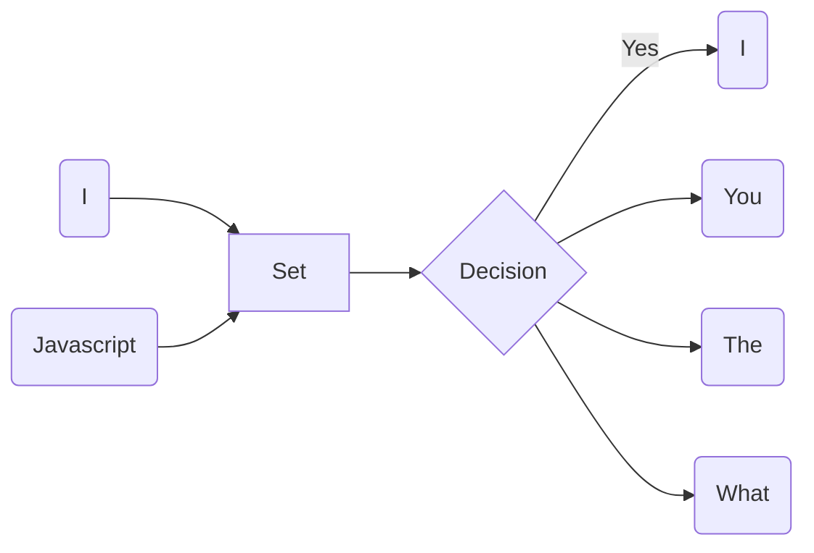

## 基本实现

接下来来讨论下如何在代码中实现这个过程. 因为目标是英文, 使用空格就可以分词了.相比中文来说很容易处理. 不过因为空格分出来的可能还带有标点符号, 所以需要把它们去掉. 先定义几个常用的标点符号

```js
const punctuation = '!"#$%&\'()*+,-./:;<=>?@[\\]^_`{|}~';	
```

在 JS 中, 这种类型可以交给正则表达式. 比如一个句子, `your are, so good!`. 要想把它拆成 `['you', 'are', 'so', 'good']` 的话, 再将上面的标点符号改为正则的形式

```js
const reg = new RegExp(`[${punctuation}]`, 'gm')
```

其实仅仅只是在原来的基础上包了一对 `[]`, 因为 `[]` 实现的就是多个匹配一个.

最后的话, 针对一大段文字, 就能这样

```js
const words = txt.replace(reg, '').split(' ')
```

有了分词的算法, 下一步就把每个链接和分支对应上来. 先以 `cherrio` 为例子, Stack Overflow 网站的正文都是在一个 `div.container` 下面, 也能判断很可能它们是由 React 编写的, 当然这是后话了.

运行 `$('div.container').text().replace(reg, '').split(' ')` 就能将整个网站的文本全部拆分开来. 接下来需要做的事情就是建立索引.

先用一段不能运行的 JS 代码来展现整个思路. 

```js
const index = allPages.reduce((index, page) => {
  const words = cherrio(page)('div.container')
  	.text().replace(reg, '').split(' ');
  
  words.forEach(word => {
    if (index[word]) {
      index[word].push(url)
    }
    index[word] = [url]
  })
  
  return index
}, {})
```

假设 allPages 就是我们需要遍历的所有的网页数据, 那么可以遍历它, 来获得单个网页的文本内容. 接下来就像上面说到一样, 建立一个分词数组. 之后再判断索引中时候已经有该单词, 作出对应的逻辑. `reduce` 和 `forEach` 可以看成对 for 循环的一种**抽象**

尝试运行一下后, 可以得到下面结果


为什么一个 URL 会被多次加进来呢? 原因也很明显, 整个网页的单词冗余度是很高的, 所以一个单词出现的次数可能不止一次. 解决这个问题的方法有几种, 

1. 将数组改成 Set
2. 每次插入之前检查数组的最后一个 URL 是否和这个 URL 相同

本文选择使用第二种方案, 因为每个 URL 之后被爬取一次, 换句话说, 这个数组即使冗余一定是 `[a,a,a,a,b,b,b,c,c]` 这种形式, 而不是是 `[a,a,a,b,b,a,b,a,c]` 这种形式. 而第一种方法, 看上去也只需要 $O(1)$ 的时间复杂度, 但是 Set 的初始化过程并不那么简单. 很可能需要伴随着至少 16 个字的空间一起分配出来. 另外为了保存成 JSON,  Set 再转化成数组也是有开销的. 

所以将 `if(index[word])` 改为 `if(index[word] and index[word][-1] != url)` 就行了.

## 和爬虫整合

现在已经理清了基本的逻辑, 是时候整合进代码了. 和上面不同的是, 这个过程应该是和爬取过程是同时进行的, **没有人希望自己的磁盘被这些网页塞满.** 回忆下之前的 strcpy 的代码, `parse` 函数是爬虫的关键逻辑所在, 所以只需要将建立索引的逻辑也放在这里. 同时在爬虫结束后, 还需要将索引写入文件.

根据 scrapy 文档, `close` 函数会在爬虫终止后调用, 所以可以在这里实现保存索引的功能. 

```python
    def close(self):
        with open('./index.json', 'w') as f:
            f.write(json.dumps(self.index, indent=2))
```

这是在以 Stack Overflow 为种子网页爬取后的部分保存结果

```json
  "tsql": [
    "https://stackoverflow.com/?tab=month",
    "https://stackoverflow.com/users/2919045/hkravitz"
  ],
  "join": [
    "https://stackoverflow.com/help/badges/644/join?userid=650492",
    "https://stackoverflow.com/users/650492/johan?tab=badges",
    "https://meta.stackoverflow.com/questions/359465/should-serial-downvoter-be-punished-notify",
    "https://meta.stackoverflow.com/questions/251758/why-is-stack-overflow-so-negative-of-late",
    "https://stackoverflow.blog/2018/02/05/secret-behind-great-developer-onboarding/"
  ],
```

可以看到每个单词都对应着它出现过的网页的链接.

但是, 还有一件很重要的事情被遗忘了. 自然语言的冗余度很高, 像有些单词每个网页出现的频率都会非常高, 比如 *The, I, Do, You, How, What* 这些, 而且它们对提升搜索的体验也不是很必要, 所以应该做一些预处理把它们去掉, 本文收集了 50 个左右的**占位符**.

它的实现也很简单, 从 JSON 文件中读取占位符列表, 因为本文的列表较小, 所以直接采用暴力的 filter 方法对每一个单词都进行了检查. 也算是图个方便. 比较在意性能的话, 可以将单词列表改为一个集合, 这样就可以优化性能. 就像下图一样




### 整合

现在可以把索引利用起来. 和上面的搜索热门话题的处理比起来, 其实这里反而更加简单了. 因为索引里就是一个对象数组, 数组里存的都是 URL. `try` 块中的主要的代码改成下面这样就行了. 

```js
    if (index === null) {
      const txt = await readFile(filePath, {
        encoding: 'utf-8',
      });
      index = JSON.parse(txt);
    }

    const search = index[q];
    if (!Array.isArray(search)) {
      ctx.body = 'Nothing search';
      return;
    }

    ctx.body = search;
```

同样的, 后端“接口”改了, 前端也需要做一点处理. 因为现在收到的是 URL 数组, 还像之前一样可不行. 毕竟在 HTML 会自动去除换行和空格. 所以将接口的数组调整为某种 List 的形式. 在这里就是 URL List. 为了让纯 URL 看起来不那么单调, 我调整了一下 UI. 

```js
<div className="content">
  {Array.isArray(response) ? (
    <ul>
      {response.map(result => (
        <article className="message is-link" key={result}>
          <header className="message-header">
            <a href={result}>{result}</a>
          </header>
          <div className="message-body">You got me!!!</div>
        </article>
      ))}
    </ul>
  ) : (
    <p>Nothing Search.</p>
  )}
</div>
```

关键改动是这一块, 可以看看效果. 在输入 react 的时候.


可以看到的我索引了有四个链接, 并且对应的 URL 链接都已经显示出来. 而 *you got me* 这个占位符可以在后续通过服务器预处理, 将网页的内容一并返回回来.

这样, 索引的建立就告一段落了. 下面介绍一下 Rank 算法.