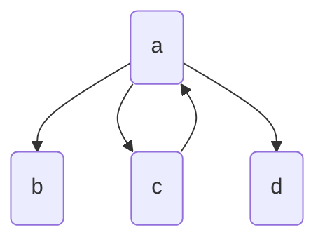
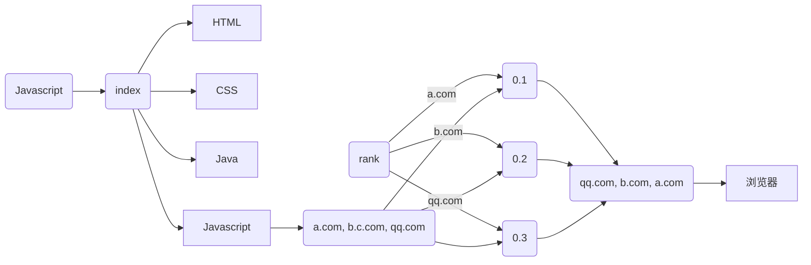

# 排序算法

目前已经索引已经构建完成, 当搜索**某个单词**的时候, 可以通过索引找到这个单词出现过得所有 URL. 但是一股脑的把这些 URL 丢出来并没有什么用. 本文的索引还不够给力, 可能某个单词对应的 URL 就几个, 这个时候排序也没那么必要. 但是产品级的搜索引擎可能不能这么敷衍了事, 所以这里也尝试构建一个简单的算法来模拟这个过程.


## 欢迎程度

首先需要定义一下怎么样的网页才算受欢迎的. 先拿我们自己来做比方, 一个人收欢迎的一种可能性, 是它的朋友多吗? 想象一下, 一个微博的大 V, 它的粉丝有几千万, 包括作者本人. 根据上面说法, 算是很受欢迎的一个人, 但是通过他的微博发现, 他的微博转发量和他的粉丝数的有数据级的差别, 可能只有一两万条. 为什么会这样? 因为他的粉丝有很大一部分是像作者这样的从来不评论的小白, 他们粉丝也少的可怜. 这一部分用户对于大V 来说完全没有**任何价值**, 充其量只是一个数字罢了. 
用互联网术语解释: **仅仅只是流量, 但是完全不能变现.** 所以这个微博大 V 并不是很受欢迎. 

那么到底怎样才算受欢迎呢? 应该是所有朋友受欢迎程度的总和才对. 用一个公式来定义.

$Popularity(p) = \sum_{f\in p's friends}Popularity(f)$

但是这个公式有一个问题, 它没有定义一个初始情况. 因为 **不好定义**. 定义一个没有任何朋友的人欢迎程度为 1? 那如果他一个朋友都没有, 根本就不会出现在这个公式中, 因为根本无法引用到他. 那定义某个人的欢迎程度为 1? 这似乎也不行, 因为不是每个人都会和他成为朋友. 针对这种不好定义的问题, 需要采取一种新的定义方法: **松弛算法**

这种方法的思路是不断的尝试. 先定义一个初始的结果(这个结果可以随便定), 然后通过不断地尝试直到每个条件成立的时候为止. 回想求 x 的平方根, 它的思路就是先假设结果是 g, 这里 g 就定义成 1 就好. 通过不断地对比 x / g 和 g 的值时候足够接近, 不满足的话继续猜测, 一旦满足就是答案. 而这种猜测方法就被称为 [牛顿迭代法](https://zh.wikipedia.org/wiki/牛顿法)

而在本文的例子中, 对于受欢迎并没有一个像数学一样可能确定的值, 所以调优的方式比较简单. 就是多运行几次. 像下面的公式一样
$$
Popularity(p, t)_{t == 0} = 1
$$

$$
Popularity(p, t)_{t > 0} =  \sum_{f\in p's friends}Popularity(f, t - 1)
$$


## 网页排序

现在回到网页排序本身, 定义一个网页的受欢迎程度的指标为

> 其他网页指向当前网页的网页数量

但是这又回到了上面的受欢迎问题, 如何判断一个网页的欢迎程度呢? 
本论文的方式是: **计算随机一个网页到底这个网页的几率**

通过从一个随机网页开始访问, 不断地重复这个过程, 算出每个网页被访问过的次数, 就能得到受欢迎程度了. 和上面的判断好友受欢迎程度的方法很类似:


$$
Rank(url, 0) = 1
$$

$$
Rank(url, t) = \sum_{p\in inlinks[url]} rank(p, t - 1)
$$

不过考虑到一个网页中可以有多条链接, 考虑到公平性, 应该将多条链接的网页的权重降低. 所以调整公式为 
$$
Rank(url, t) = \sum_{p\in inlinks[url]} rank(p, t - 1) / outlinks[p]
$$
这里的 $outlinks[p]$ 指的就是网页 p 的链接数.

最后, 还有一个小问题. 一个新的网页, 可能根本没有外部链接指向它, 根据上面的公司它们的 Rank 就会是 0, 这显然不够友好. 通过引入一个**阻尼常量**, 微调其他网页决定排名的占比, 给每个网页一个起始 Rank, 就能保证不会出现 0 的情况. 最后的公式为
$$
Rank(url, 0) = 1 / npages
$$

$$
Rank(url, t) = (1 - d) / npages + \sum_{p\in inlinks[url]} d • rank(p, t - 1) / outlinks[p]
$$

这里的 d 就是阻尼常量. 这个公式也很容易被 JavaScript 实现.

## 实现方式

考虑下面的图片, 节点表示网页, 边表示网页指向的网页. 



代码的结构可以为

```js
const graph = {
  a: ['b', 'c', 'd'],
  b: [],
  c: ['a'],
  d: []
}
```

希望你已经注意到, 之前的爬虫已经实现了这个功能, 并将它保存为 JSON 文件. 接下来只需要根据上面的公式写出代码. 下面是实现

```js
function computeRanks(graph) {
  const damping = 0.8;
  const loops = 10;
  let ranks = {};

  const pages = Object.keys(graph);
  const { length } = pages;
  pages.forEach(link => (ranks[link] = 1.0 / length));

  for (let i = 0; i < loops; i += 1) {
    const newranks = {};
    for (const page of pages) {
      let newrank = (1 - damping) / length;
      for (const node of pages) {
        if (graph[node].includes(page)) {
          newrank += damping * (ranks[node] / graph[node].length);
        }
      }
      newranks[page] = newrank;
    }
    ranks = newranks;
  }
  return ranks;
}
```

为了性能上考量, 代码的实现不能像数学公式那样使用递归, 因为 graph 的数据量可能非常大, 很容易导致栈溢出. 这段代码 for 循环太多, 不是很优雅. 可以考虑使用 `reduce` 和 `forEach` 等函数来简化. 主要需要注意 `for (const page of pages) {` 这一行, 下一行的 `newrank` 就是每个网页的初始 rank, 而 page 也就是本次计算 rank 的网页. 接下来又是一个 for 循环, `graph[node]` 的意义是一个网页的所有外链. 所以这段 if 语句的功能就是: 如果某个网页的外链中有它, 就增加 rank 的值. 最后只需要将当前网页的 rank 值存入 ranks 字典中.

需要注意的是, 如果一个网页外链了另外一个网页多次, 在本算法中也只会增加一次 rank 值.

有个上面的算法, 可以对爬虫搜集的信息进行一个处理. 将 ranks 保存成 JSON 后, 可以得到.


接下来把 ranks, index 组合起来, 看看现在搜索引擎的效果.


首先需要改写服务端的代码. 相比之前只需要读取 index 的文件, 现在需要还需要一个 rank 的数据. 在 nodejs 也很容易实现.

```js
const reads = Promise.all([
	readFile(indexFilePath, 'utf-8'),
	readFile(rankFilePath, 'utf-8'),
]);
[index, rank] = (await reads).map(JSON.parse);
```

抛开语言的细节, 这里就是同时读取两个文件, 将它们由 JSON 转为 JS 对象, 并赋值给对应变量.

接下来的过程就是通过 index 获得搜索关键词对应的 URL 数组, 对应到 rank 字典中, 获得对应的 rank 值, 排序后展示出来. 



最后看一下实现代码.

```js
const search = index[q];
const sortSearchResult = pipe(
  map(url => ({
    url,
    rank: rank[url],
  })),
  sortWith([descend(prop('rank'))]),
  tap(console.log),
  pluck('url'),
);
const getResult = ifElse(is(Array), sortSearchResult, () => 'Nothing Search');
ctx.body = getResult(search);

```

map 的操作就是根据 URL 数组返回一个对象数组, 对象的属性为 URL 和 Rank 值. 接着根据 Rank 值来排序该数组, 最后再将 Rank 值剔除并返回给浏览器. `tap` 这一样的目的主要是在中间插入一段 log, 并没对数据做什么处理.

最后可以尝试搜索: *map*, 观察服务器的日志.

```js
{ url: 'https://meta.stackoverflow.com/users/634474/dymmeh',
     rank: 0.00033062140083032 },
   { url: 'https://stackoverflow.com/users/8013925/jdickel',
     rank: 0.00033049353701527606 },
   { url: 'https://stackoverflow.com/users/679671/swordfish',
     rank: 0.00033039170373793975 },
   { url: 'https://meta.stackoverflow.com/users/298661/puppy',
     rank: 0.00033039170373793975 },
   { url: 'https://stackoverflow.com/questions/27491601/c-getting-compilation-error-while-insert-string-into-a-map',
     rank: 0.00032894736842105257 },
  { url: 'https://meta.stackoverflow.com/questions/356091/show-anonymized-but-complete-voting-information-to-moderators',
     rank: 0.00032894736842105257 },
   { url: 'https://stackoverflow.blog/2008/10/12/a-question-about-questions/',
     rank: 0.00032894736842105257 } ]
```

算法已经生效了. 不过这个 rank 其实还是有点问题, 因为它们实在太小, 对于 IEEE 浮点数标准来说, 很可能这些数字都不是精确的值, 这样就会导致偶尔排序不准. 


## 支持多个关键词搜索

支持多个关键词的第一步和爬虫一样, 还是分词, 而且每次分词也要将属于 **stopwords** 的关键词去掉. 因为索引中根本不存在这些词, 搜索出来肯定会影响结果.