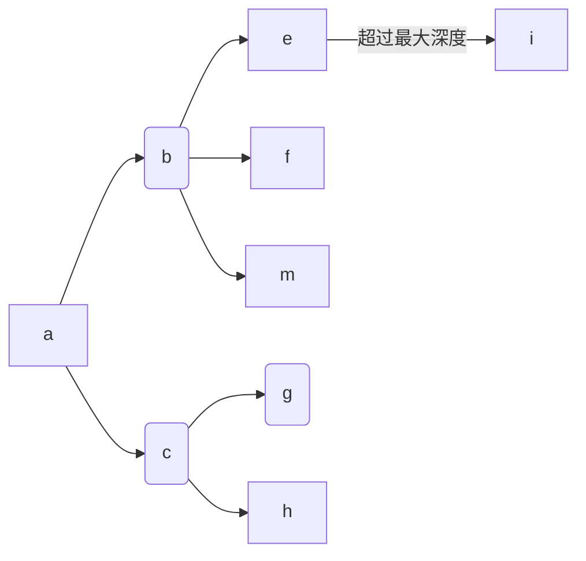
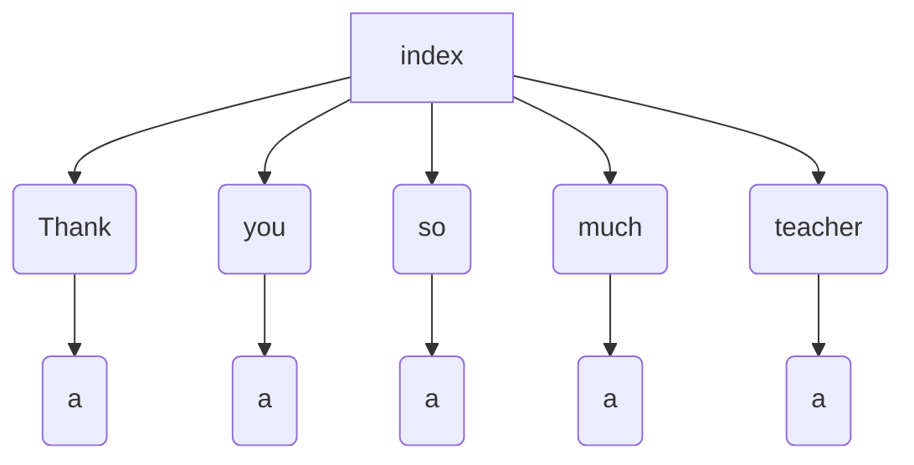
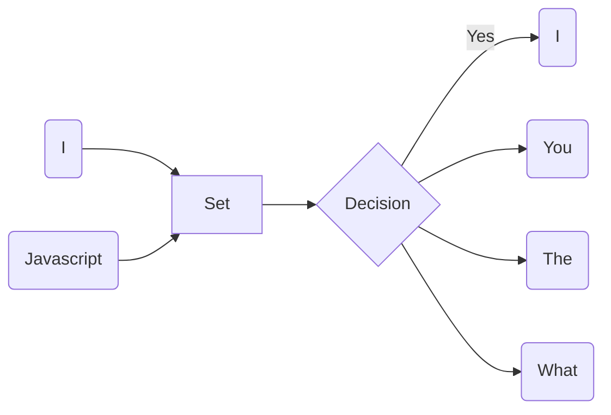
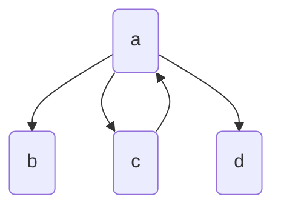
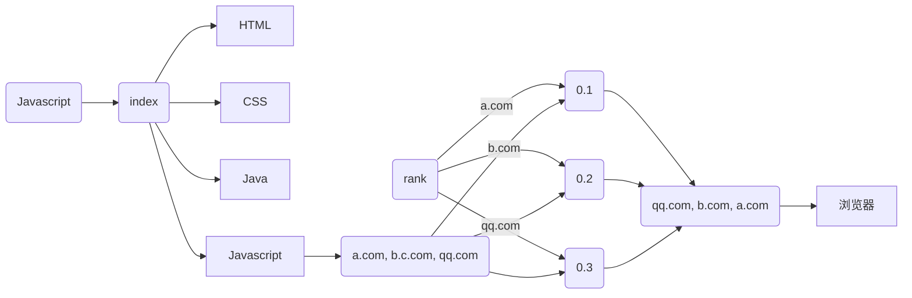

# 面向小规模量的全文搜索引擎的设计和实现

# 摘要

时代飞速发展, 技术日新月异, 对开发者的要求也越来越高. 当年的“切图仔”演变成现在的**全栈工程师, 大前端**就是前端工程师的发展写照.
曾经认为女生才应该去写前端的, 前端就是写写界面的人, 在目前看来可以说是错的离谱.
最基本的前端工程师需要了解的知识体系甚至比后端还复杂. 每一个前端工程师都需要会写服务器代码, 每一个前端工程师都需要会写原生应用.

好在 JavaScript 确实赋予了他们这种能力. Nodejs 是让前端开发者抬起头, 后端开发者学习前端的一个跨时代的平台. React Native 的出现让 JavaScript 也能写 iOS 和 Android 应用. Electron 更是让 JavaScript 可以攻占桌面级的应用. 本论文编写的所有代码都是由一个基于 JavaScript 搭建的编辑器完成.

可以说, JavaScript 的生态已经势不可挡了. 所以本论文也通过搭上这本快车, 使用 Js 来投建一个简易的搜索引擎, 来探索**全栈的可能性**. 其中前端采用的是 React, 后端基于 Nodejs 搭建.

该搜索引擎会爬取 Stack Overflow 的一些内容, 尝试在输入关键字后, 能够将本站的相关网页显示出来. 排名的方式主要基于其他网页索引该网站的次数.

关键字: React; Koa; Nodejs; Search Engine; Python;


# Abstract

With the rapid development of the era, technology is changing with each passing day, and the requirements for developers are also getting higher and higher. The “front-end engineers” of the entire “stack” engineer nowadays are the development portrayal of front-end engineers.
Those who think that girls should write front-ends, front-end writers and writers seem to be wrong at the moment.
The basic knowledge that front-end engineers need to understand is even more complex than the back end. Every front-end engineer needs to write server code. Every front-end engineer needs to write native applications.

Fortunately, JavaScript really gives them this ability. Nodejs is a cross-generational platform for front-end developers to look up and front-end developers learn about the front-end. The emergence of React Native makes it possible for JavaScript to write iOS and Android applications. Electron is Let JavaScript take over desktop-level applications. All the code written in this paper is done by a JavaScript-based editor.

It can be said that the ecology of JavaScript has become overwhelming. Therefore, this paper also hopes to use JS to build a simple search engine to explore the possibility of a full stack. The front end uses React, backend built by Nodejs.

The search engine crawls some of Stack Overflow's content and tries to display the site's related webpage after entering the keyword. The ranking method is mainly based on the number of times other websites index the website.

Keyword: React; Koa; Nodejs; Search Engine; Python;

# 绪论

## 发展意义和背景

随着时代的不断演进, 人们对于互联网的依赖程度, 以及对**用户体验**要求提升, 开发人员面临的挑战也越来越多. 知识和技术已经学不过来, 更新速度非常之快. 一位作者可能刚将一本技术书写完, 该技术就更新了新版本, 带来了**破坏性改变**, 一夜之间这本书似乎就过时了. 为了更快速的学习知识, 搜索引擎对于开发人员来说是不可或缺的. 面向 Google 编程, 面向 Stack Overflow 编程是一种趋势. 如果没有 Google, 开发人员很难找到解决方案. Stack Overflow 里如果不能搜索, 这个网站也没有存在的意义.
所以, 尝试自己去搭建一个搜索引擎, 是十分必要的. 再也不用惊叹于搜索的神奇, 拉近和后端工程师们的距离.

## 发展趋势

国内: 国内的搜索引擎以百度最为闻名. 但是因为过于商业化, 以及对技术人员的不友好, 基本上就和 Siri 一样, 总是答非所问. 在国内一般是作为不能科学上网的备用选择. 而其他的搜索引擎, 比如某数字公司和某动物公司的有一定的市场份额, 但基本没有尝试的必要

国外: 国外的著名的搜索引擎有: **Google, Bing, Yahoo, DuckDuckGo**. Google 和 DuckDuckGo 的英文搜索体验相当, 都能给出想要的效果, 都支持自动翻译和错别字矫正功能.
但是近年来, 随着 Google 向人工智能的发力, 我们用 Google 搜索的任何内容都会被分析, 并生成一个用户的特征模型, 以能够推送更加准确的信息流. 也就是说现在 Google 不仅仅是一个搜索引擎, 而是一套信息服务. 

本论文显然不会以模仿 Google 甚至超越 Google 的某一方面位目标, 它最大的功劳是协助这篇论文的面世.

## 系统开发目标

前端采用 React 构建, React 和传统 MVC 模式的框架不同, 采用的是一种声明式的编程方式. 将**函数式编程的思想渗透其中**. 后端采用的 Koa 是一个比较新的 Nodejs 框架. 它充分拥抱了 `async await` 模式, 让开发者从 Nodejs 的 `callback hell` 中解脱出来, 使用更为现代的方式编程.
搜索引擎的目标是在确定搜索后, 顺序的响应的用户的搜索内容, 并给出一个拥有合理排序的搜索内容.

# 基本背景知识

## HTTP 协议

为了更好的理解搜索引擎的本质和原理, 先来一起探索下它所依赖的协议: **HTTP.**
HTTP 最新版本是 2, 相比 1.1 带来革命性的提升和改变. 不过为了方便理解, 本文还是基于 HTTP 1.1 来解释整个流程. 另外, HTTP 协议以下的协议栈, 只解释到 TCP 层.

拿 Google 举例, 在搜索框中输入搜索内容后, 按下回车或者 **Search** 按钮, 开始的第一步就是将输入的内容传入一个叫做 **q** 的参数, 以及其他细节参数一起组装好. 加上 HTTP 请求行, HTTP 首部. 包装成一个 **GET** 请求. 为了简单, 这里还是忽略了很多细节, 比如 Google 的搜索建议.

这个请求可能长这样:

```http
GET / HTTP/1.1
HOST: www.google.com.hk
Accept: */*
```

包装好后, 还需要一个伙计将该请求传送到 Google 的 IP 下. 关于获取 IP 的方法不是本文的重点, 只要知道是通过 **DNS** 协议来实现的. 一旦获取到 IP, 这个伙计就能工作了. 欢迎 **TCP**

TCP 协议最广为人知的地方就是它的三次握手, 简单回顾下.

1. 浏览器发出一段 datagram 给 Google , 里面包含了 SYN 字段
2. Google 收到该 datagram 后, 作出处理(比如分配内存), 也发出一段 datagram, 包含了 SYN 和 ACK 字段
3. 浏览器收到 datagram, 将之前的生成的 HTTP 请求和 ACK 字段一起发送给 Google

```sequence
Browser -> Google: SYN
Note right of Google: Google Server alloc socket and resource, and response
Google -> Browser: SYN ACK
Browser -> Google: ACK Body
```


经过这些步骤, Google 服务器终于知道要搜索什么内容, 并做了一番处理, 将结果返回给了浏览器. 这里的一番处理可不简单, 也是本文的努力目标.

浏览器获取到了 Google 的响应, 比如这样

```http
HTTP/1.1 200 OK
content-type: text/html
content-length: …

…………
```

Google 返回的仅仅是一个 HTML 文件. 随着浏览器去解析该 HTML 文件, 接着就会将 HTML 中的其他**关键路径上的文件**获取. 比如 CSS, JS 或者其他 SVG 图片. 最后就能看到结果.

## TLS

上面其实遗漏了一些内容. Google 现在是基于 HTTPS 的, 也就是说, 在发送 HTTP 请求之前, 还需要和 TLS 协议进行一段沟通. 相比 TCP, 过程更为复杂.

1. 浏览器发送一段 _Client Hello_ 信息给 Google, 并且带上了一个随机数和支持的加密方法(协商)
2. Google 回应了一段 _Server Hello_ 信息给浏览器, 带上了一个随机数
3. 同时 Google 把它的证书发送给浏览器(在某些金融网点, 还需要浏览器提供证书). 这是一个 _Server Done_ 信息
4. 浏览器确认 Google 的证书有效, 就会生成第三个随机数, **Premaster secret**. 用 Google 的公钥加密这个随机数并发送给 Google. 如果发现证书无效或者过期了, 浏览器就会发出警告, 阻止用户访问
5. Google 使用自己的私钥解密了这个浏览器. 这个时候, Google 和浏览器都会使用这三个随机数生成的一个会话秘钥 **session key** 来加密接下来的信息
6. 浏览器会发送一个 _Change cipher spec_ 来通知 Google, 接下来所有的信息都要开始加密. 同时发送 _Client Finished_ 信息
7. Google 收到了该通知, 开始使用会话秘钥. 并发送 _Server Finished_ 信息
8. 现在浏览器和 Google 已经建立好加密通道, 所有的消息都会被加密. 接下来的步骤就回到了上面的 TCP 过程

这个过程确实很复杂, 至于公钥和私钥的生成细节这里就忽略, 以便带来更多的复杂性.
虽然本文跳过了一些步骤, 但是主要的过程已经描述清楚. 可以看一张图来巩固一下


回到 Google 返回 HTML 的地方, 浏览器到底是如何使用 HTML, CSS, JavaScript 在屏幕上渲染漂亮的网页呢?

## 关键渲染路径

一个 HTML 文件从加载到显示出来的过程, 被称为 **关键渲染路径**. 一般分为 4 个步骤

1. DOM 树构建
2. CSSOM 构建
3. 布局(Layout)
4. 绘制(Paint)
   本文暂且不讨论 JavaScript 的逻辑. 因为现代 JavaScript 过于复杂, 这方面有很优秀的[素材](https://developers.google.cn/web/fundamentals/performance/critical-rendering-path/adding-interactivity-with-javascript)

### DOM 树的构建

为了简化复杂性, 先假设 HTML 里仅仅包含一些简单的文本和一张图片, 则 DOM 树的构建过程为

1. **转换:** 浏览器先读区磁盘(缓存)或者网络中 HTML 的原始字节, 使用文件指定的编码方式(UTF-8), 将它们转化成字符
2. **Token 化:** 将字符中所有 W3C 标准中规定的标签[^1]换成特定的 Token
3. **词法构建:** 将所有 Token 转化成规则对象
4. **DOM 构建:** 根据标签和标签之间的包含关系来建立 DOM 树


整个流程还可以用一张图来表示


### CSSOM 构建

在构建 DOM 树的构成中, 会碰到 `link` 标签. 如果标签中引用了 css 文件的话, 浏览器**优先去**构建 CSSOM, 和过程和构建 DOM 树相似.

### 渲染树

在 DOM 和 CSSOM 都构建好后, 浏览器就会将 DOM 和 CSSOM 合并, 生成新的 **Render Tree**
为了构建它, 浏览器做了这些步骤:

1. 从 DOM 树根节点开始遍历不可见的节点: `meta, script`, 不会出现在渲染树中通过 CSS 隐藏的节点: `display: none`, 也不会出现在渲染树中
2. 对所有可见的节点, 应用 CSSOM 的规则
3. 生成渲染树


接着根据渲染树中的样式信息, 浏览器进入 **Layout** 阶段. 这个阶段是为了弄清每个对象的确切位置和大小. 最后根据位置和大小, 浏览器就能将它们写入实际的像素中, 这里被称为 **Paint**

经历“穷山恶水”, 浏览器终于成功渲染了这些文字和图片.


# 编写爬虫

了解了基本的浏览器的运行机制, 现在可以进入到正题. 搜索引擎的构建, 在本文中, 主要分为三步:

1. 构建爬虫
2. 使用爬取的数据构建索引
3. 寻找一个合理的 Rank 算法

为了方便后文引用, 本文构建的搜索引擎用 YSE 来取代.
作为一个小型项目, YSE 不可能也不应该尝试去像其他搜索引擎一样, 爬取所有互联网上的页面, 应该将爬虫放在某个特定的网站下面, YSE 使用的是 [Stack Overflow](https://stackoverflow.com) 作为**种子** , 也就是爬虫开始的第一个界面.

## 获取一个网页上的超链接

为了测试爬虫的可行性, 先将任务简化, 从只获取一个网页的所有 **href** 开始, 不做任何文本处理. 在这里 href, 或者说 _Hyper Reference_, 指的是 a 标签的 href 属性. 比如, **img, css, JavaScript** 这些文件都不是爬虫感兴趣的内容. 根据 [CSS Selector](https://www.w3schools.com/cssref/css_selectors.asp) 规范, 使用一个很简单的 CSS 选择器就能实现 `a[href]`.

爬虫是基于服务器建立的, CSS 选择器属于 W3C 标准, 这个似乎应该只能在浏览器中存在, 怎么运用在后端呢? 这里需要澄清下, **标准是标准, 实现是实现. 实现可以参考标准, 并在任何平台实现**. 所以说, 浏览器上的 CSS 选择器是浏览器的实现, 后端当然也有后端的实现, 比如本文将要采用到的 [cheerio](http://cheerio.js.org), 就是 Nodejs 的一种**实现**

通过包管理工具下载好 cheerio 后, 输入
`import cheerio from 'cheerio'`
就能开箱使用了. 而想要获取一个网页的所有 href 内容的话, 可以写成

```js
const text = '………'; // text 变量是一长串文本
const $ = cheerio(text);

const allLinks = $('a[href]').map((_, element) => $(element).attr('href'))).get()
```

通过这种方式, 就能获得 text 所代表的 HTML 中所有的 href. 但在真正中的爬虫中, 传入的参数应该是 URL, 而不是整个 HTML 文件. 毕竟一个爬虫, 应该只需要关注种子网页就行了.

```js
const url = 'https://www.google.com';
const getPage = async url => {
  try {
    const html = await fetch(url).then(res => res.text());
    return cheerio.load(html);
  } catch (err) {
    console.log(err);
  }
};
const $ = getPage(url);
```

Fetch URL 的操作, 就由第四行, 也就是含有 `fetch` 的那一行完成了这个任务.
这样的话, 获取所有链接的任务就和之前的代码一样, 因为此时的 `$` 已经获得了 URL 的 HTML.

这段代码看上去没有任何问题, 不过, 还有一个隐藏的问题需要指出来.
`fetch` 只能支持**绝对路径**的 URL!
这很容易理解, 给一个 \_.\_abc.html/ 这种链接, 这应该被认为是读取本机文件的操作, 与其用 fetch 不如使用 `readFile`.
但是什么时候会碰到相对路径的情况呢?? 乍一看很难理解, 因为我们可以控制种子网页的内容, **不可能会传一个相对路径的 URL 进去**. 可是不能保证 a 标签中的 href 不是相对路径!
这个问题有两种方法来解决, 第一种是过滤所有的相对路径, 第二种则是将相对路径转化成绝对路径. 第一种实现简单, 只需要改一下选择器, 改为 `a[href^=http]` 就解决问题了. 这个选择器的意思就是**筛选所有 href 属性由 http 开头的 a 标签**, 这样就能保证得到的路径都是绝对路径.
从开发人员的角度, 相对路径比绝对路径好写多了. 所有一个网站中, 更多的可能使用的还是相对路径, 这种自损三千的方法, 接下来会改进.

## 放出爬虫

现在已经知道如何获得一个网页中所有的 href, 可以使用下面的代码来看看效果

```js
console.log(allLinks(getPage('https://stackoverflow.com')));
```

不出意外的话, 会输出类似于这样的结果.


接下来可以将爬取到的所有网页内容, 加入数组, 递归执行爬取步骤.
既然是递归, 就需要有一个递归的终止条件. 这里的终止条件就是数组为空为止.

不过会引发一个问题, 数组一定会为空吗? 答案是很可能不会
原因有几点:

1. 存在外链
2. 链接之间会相互引用
3. 链接太多

最后一个很容易理解, 如果链接太多的话, 那么想要在相对短的时间内爬取所有网页显然是不可能的. 一个可行的方法是规定爬取次数否则爬取时间. 比如爬取 10000 个或者运行十分钟后停止.
前面的两个原因, 也能很好的解决. 第一个问题我们只要对爬取到的链接进行一次筛选, 将主机不是 Stack Overflow 的域名去掉. 而第二个循环链接的问题, 可以通过保存所有访问过的链接, 并且只访问没有访问过得链接来解决.
其实循环链接的问题和广度优先搜索的解决方法很相似. 没错, 爬虫使用的就是广度优先的策略. 为什么不用深度优先呢? 因为这很容易导致栈溢出…

通过上面的分析, 爬虫终于可以派上用场了.

```js
const crawlWeb = async seed => {
  let tocrawl = [seed];
  const crawled = {};

  while (tocrawl.length) {
    const page = tocrawl.pop();
    if (!crawled[page]) {
      const $ = await getPage(page);
      const outlinks = getAllLinks($);
      tocrawl = union(tocrawl, outlinks).filter(link => {
        return new URL(link).hostname.includes('stackoverflow');
      });
      crawled[page] = true;
    }
  }
};
```

接下来要解决之前遗留的问题: **处理相对路径**. Nodejs 的 URL 方法只能转换绝对路径, 否则就会抛出异常.
比如 `new URL('./abc')` 这样就会报错. 于是可以利用它的报错, 配合 `try catch` 来将相对路径转化成绝对路径. 回到之前 `getAllLinks`

```js
const getAllLinks = ($, page) => {
  const { origin } = new URL(page);
  return $('a[href]')
    .map((_, element) => {
      const href = $(element).attr('href');
      try {
        new URL(href);
      } catch (err) {
        return href[0] === '/' ? `${origin}${href}` : `${origin}/${href}`
      }
      return href;
    })
    .get();
};
```

`getAllLinks` 和之前相比多了一参数—page, 它用来保存正在爬取的网页的信息. 可以通过它了解到当前网站的 hostname 和 origin, 再添加到相对路径之前就可以得到绝对路径.

### 限制搜索深度和长度

因为现实的复杂性, 还是不能盲目的假设爬虫最终会停下来, 所以还是要限制下爬虫的搜索深度和长度搜索的长度很容易限制, 回忆这个代码 `while (tocrawl.length)`

除了每次检查数组的是否为空外, 也要检查当前数组的长度, 如果超过了一个限制值, 也会的结束爬取. 改成 `while (tocrawl.length && len(tocrawl) < maxLength)` . 同样的搜索深度也可以做到限制. 




解释下这张图, a 网页里包含了两个 b 和 c 网页. 当爬取完  a 后, 深度加一. 继续开始爬取 b 和 c 的网页, b 又有 e 和 f, m, c 网页又有链接 g 和 h. 当 g 和 h 爬取完后, 深度继续加一. 就这样通过跟踪深度, 就能在合适的时机退出来. 

### robot.txt

但是爬虫并不是肆无忌惮的. 一般网站都会有一个 [robot.txt](https://en.wikipedia.org/wiki/Robots_exclusion_standard) 文件, 来告诉爬虫: 哪些路径是运行爬取的, 而哪些路径是不运行爬取的.
爬虫必须遵守它的规则, 否则本地的 IP 很容易被网站加入黑名单, 再也不能访问该网站. 所以我们的爬取策略也要做出修改, 在开始爬取之前先读取站点的 robot 文件.
这个文件的位置很有讲究, 一般都位于网站的根目录下. 比如 Stack Overflow 的 robot 地址应该是 `stackoverflow.com/robot.txt`.

它的 robots 部分样子


针对这种简单形式的 robot, 可以实现一个自己的解析函数

```js
const fetchRobot = async url => {
  const robotUrl = `${url}/robots.txt`;
  const disallow = [];
  if (robotUrl) {
    const robot = await fetch(robotUrl).then(res => res.text());
    robot
      .split('\n')
      .filter(str => str.startsWith('Disallow'))
      .forEach(ban => disallow.push(ban.slice(ban.indexOf('/'))));
  }
  return disallow;
};
```

因为结构的单一, 只需要取出所有以 `Disallow` 开头的行的链接, 得到一个数组. 因为这个数组也不长, 在检测时候是合法链接的时候, 可以尝试一种十分低效但是简单的方式: 对于爬取的每个链接都在这个数组中检查一下.

## Scrapy

可是为了实现一个搜索引擎, 上面的这种方法就不行了, **它不够快**. 浪费太多笔墨来强调如果写出一个高性能的 Nodejs 爬虫是不划算的. 介绍 Scrapy 一个强大的 Python 爬虫框架来完成 YSE 接下来的爬取任务.

官方对它的介绍是:

> An open source and collaborative framework for extracting the data you need from websites.
>
> In a fast, simple, yet extensible way.


注意第二句, **yet extensible  way** 满足了性能上的需求. 而上面提到的爬虫需要注意的问题, 它已经全部抽象了. 使用者只需要专注于如何编写爬虫的逻辑, 不需要考虑其他的细节.


根据官方文档, 可以很容易写出几个爬虫, 用来爬取特定的内容. 以 Stack Overflow 官网为例, 如果想知道今天的问题有哪些, 可以自己上浏览器输入, https://stackoverflow.com/?tab=featured. 也可以手动写一个爬虫, 来爬取关注的信息. 这里以获得每个问题的

- 投票数
- 回答数
- 浏览量
- 标题

为例, 可以写出下面代码

```python
import scrapy

class StackSpider(scrapy.Spider):
    name = 'stackoverflow'
    start_urls = [
        'https://stackoverflow.com/?tab=featured',
    ]

    def parse(self, response):
        for question in response.css('.question-summary'):
            yield {
                'votes':
                question.css(
                    'div.votes .mini-counts span::text').extract_first(),
                'views':
                question.css(
                    'div.views .mini-counts span::text').extract_first(),
                'answers':
                question.css(
                    'div.answered .mini-counts span::text').extract_first(),
                'title':
                question.css('.summary > h3 > a.question-hyperlink::text')
                .extract_first(),
            }

```

代码中的 CSS 不仅仅遵循了 w3c 标准, 而且还做到了扩展. 在 cherrio 中, 找到某个特定选择器的元素里的文本内容, 需要  `$('.votes .mini-couts span').text()`, 而 scrapy 通过一种类似于**伪元素的拓展**做到了可以获得 text 的内容.

接着在命令行中运行

```bash
scrapy crawl stackoverflow -o stackoverflow.json
```

这样可以将所有爬取到的内容整理成一个 JSON 文件. 有了 JSON 文件, 相比每次搜索都立刻去爬取数据, 速度就能快很多.


## 前后端

有了数据, 就开始利用它们. 可以开始快速搭建开发所需要的代码了. 

### 后端

基于 Nodejs 的应用都离不开包管理工具, 但是它又不同于 Python 中的 `pip`. `pip` 在安装了某个包后, 就可以在任意代码中 `import` 导入它. 而 Nodejs 的 npm 或者 yarn, 只能每一个开发环境都装一次, 第一次看到会觉得非常麻烦. 这显然和 JavaScript 这个语言的背景有关, 因为它最早的定位就是在浏览器中运行, 而且是一本脚本语言. 在浏览器中运行说明它的权限肯定会被限制, 只能读取相对路径的文件. 同时, 又因为它是脚本语言, 只会在运行的时候开始读取所需要的资源. 

不过, Nodejs 作为一个运行时环境, 也有自己的一些内置组件. 这些组件已经被预装在 Nodejs 中, 可以在任何项目中直接读取. 

开始安装所需要的包:

```bash
mkdir myproject && cd $_ && yarn add koa koa-router axios classnames
```

因为已经将爬虫的工作交给 scrapy, 暂时就不用安装 cherrio 了. 

现在只是只是为了看看成果, 服务端代码还不会多么复杂, 添加一个路由就行了.

```js
import Koa from 'koa';
import router from './route';
const app = new Koa();

app.use(router.routes());

app.listen(3001);

```

加起来也就 5 行代码, 运行后就能监听 3001 端口. 第二行的 route.js 里面服务端和路由有关的代码. 只需要搜索的功能, 所以只定义一个 `/search` 路由就已经够了. 这段代码也很简单

```js
import fs from 'fs';
import path from 'path';
import { promisify } from 'util';
import Router from 'koa-router';
import { URL } from 'url';

const readFile = promisify(fs.readFile);

const router = new Router();
const filePath = path.resolve(__dirname, '../db/stackoverflow.json');
let index = null;

router.get('/search', async ctx => {
  const params = new URL('http://localhost' + ctx.url);
  const q = params.searchParams.get('q');

  try {
    if (index === null) {
      const txt = await readFile(filePath, {
        encoding: 'utf-8',
      });
      index = JSON.parse(txt);
    }

    const search = index.filter(question => question.title.includes(q));
    if (!search.length) {
      ctx.body = 'Nothing search';
      return;
    }

    ctx.body = JSON.stringify(search);
  } catch (err) {
    console.log('file not found');
    ctx.body = 'Bad!';
    ctx.status = 404;
  }
});

export default router;

```

关键逻辑就在 `const search = index.filter(question => question.title.includes(q))` 这一行. 目前用了一种很幼稚很慢的检索方法, 在 Stack Overflow 的 feature 中逐字逐句的匹配 title. 


### 前端

现在只需要展示搜索的结果, 所以不需要注意力过分放在 UI 上. React 代码一般会分离两种概念, 一种专门用来渲染 UI 不关心任何业务逻辑的组件—Component, 另外一种则是仅仅关注业务逻辑但不关心 UI 的组件—Container.


就比如, 一个 List 组件, 可以写成下面这样子

```jsx
const List = ({data, onClick}) => (
	<ul>
		{data.map(({title, value}) => (
			<li key={title} onClick={onClick}>{value}</li>
		))}
	</ul>
)
```

这个组件只需要两个 props, 一个 data 用来控制需要展示的数据, 一个 onClick 是用来响应列表被点击的事件. 而它没有关注如果自己编写逻辑, 所有数据都是由其他的组件来传入. 这就是 Component 的本质.

同样的, 对应的 Container 的代码可以是

```jsx
class View extends React.Component {
  data = [{title: 'good', value: 'oo'}, {title: 'bad', value: 'xx'}]
  
  onClick = () => alert('You click me!')
  
  render() {
    return <List data={this.data} onClick={this.onClick} />
  }
}
```

虽然这个编造的例子看上去很生硬, 但是已经很好的完成了它的任务—实现业务逻辑


回到前端的代码上来, 目前的实现只需要有一个搜索框, 能在输入完成后, 向后端发送一个请求, 处理分析后端返回的数据并展示出来. 

大概流程是这样

```sequence
浏览器 -> 服务器: 看到我要搜索的东西了吗?
Note right of 服务器: 从磁盘中读取爬虫数据, 开始匹配
服务器 -> 浏览器: 这是你的搜索结果, 拿去
```


下面是点击搜索后的逻辑代码:

```js
  onSearch = async event => {
    event.preventDefault();
    this.setState({ isSearching: true });
    try {
      const { data } = await axios.get('/search', {
        params: {
          q: this.state.searchValue,
        },
      });

      const response = Array.isArray(data)
        ? data.map(question => question.title).join('\n')
        : data;
      this.setState({
        response,
      });
    } finally {
      this.setState({ isSearching: false });
    }
  };
```

这里的 `axios` 和前文的 `fetch` 方法的效果类似, 不过 axios 的封装更为良好, 所以后文都会采用它.

展示 UI 的代码就不展示了, 目前的效果如图所示.


如果输入一些搜索内容, 比如 `curl` 的话, 就能出现搜索的结果.


可以看到已经能搜索出正确的结果了.


# 索引

搜索引擎不仅仅是希望能搜索到某个关键字, 还要获得相应的链接, 这样才有搜索的价值.

所以需要一个结构来记录一个关键字可能出现在的所有 URL 中. 举个例子

网页 a 含有 5 个 单词: 

1. Thank
2. you
3. so
4. much
5. teacher

那么就应该生成一个这样的索引



每一个单词都保存对当前网页的引用才行. 对应到 Js 中, 就应该是

```js
const index = {
  'Thank': 'a',
  'you': 'a',
  'so': 'a',
  'much': 'a',
  'teacher': 'a',
}
```

实际过程中, 一个单词肯定不可能仅仅出现在一个网页中, 所以每个词对应的不是一个字符串, 而是一个数组. 数组保存着这个单词出现过得所有网页链接才行.


## 基本实现

因为目标是英文, 使用空格就可以分词了.相比中文来说很容易处理. 不过因为空格分出来的可能还带有标点符号, 所以需要把它们去掉. 先定义几个常用的标点符号

```js
const punctuation = '!"#$%&\'()*+,-./:;<=>?@[\\]^_`{|}~';	
```

在 JS 中, 这种类型可以交给正则表达式. 比如一个句子, `your are, so good!`. 要想把它拆成 `['you', 'are', 'so', 'good']` 的话, 再将上面的标点符号改为正则的形式

```js
const reg = new RegExp(`[${punctuation}]`, 'gm')
```

接下来就能通过内置的 `replace` 函数将标点全部去掉

```js
const words = txt.replace(reg, '').split(' ')
```

成功分词后, 下一步就把每个链接和单词对应上来. 先以 `cherrio` 为例子, Stack Overflow 网站的正文都是在一个 `div.container` 下面, 也能判断它们的网页是由 React 编写的, 当然这是后话了.

运行 `$('div.container').text().replace(reg, '').split(' ')` 就能将整个网站的文本全部拆分开来. 接下来需要做的事情就是建立索引.

```js
const index = allPages.reduce((index, page) => {
  const words = cherrio(page)('div.container')
  	.text().replace(reg, '').split(' ');
  
  words.forEach(word => {
    if (index[word]) {
      index[word].push(url)
    }
    index[word] = [url]
  })
  
  return index
}, {})
```

在这段代码中, 假设 allPages 就是我们需要遍历的所有的网页数据, 通过遍历它来获得单个网页的文本内容. 接下来就像上面说到一样, 建立一个分词数组. 之后再判断索引中是否已经有该单词, 作出对应的逻辑. 其中`reduce` 和 `forEach` 可以看成对 for 循环的一种**抽象**

尝试运行一下后, 可以得到下面结果


为什么一个 URL 会被多次加进来呢? 原因也很明显, 整个网页的单词冗余度是很高的, 所以一个单词出现的次数可能不止一次. 解决这个问题的方法有几种, 

1. 将数组改成 Set
2. 每次插入之前检查数组的最后一个 URL 是否和这个 URL 相同

本文选择使用第二种方案, 因为每个 URL 只会被爬取一次, 换句话说, 这个数组即使冗余一定是 `[a,a,a,a,b,b,b,c,c]` 这种形式, 而不是是 `[a,a,a,b,b,a,b,a,c]` 这种形式. 而第一种方法, 看上去只需要 $O(1)$ 的时间复杂度, 但是 Set 的初始化过程并不那么简单. 需要伴随着一个比较大的空间一起分配出来, 在单词量很大的情况下, 性能也并不那么突出咯. 另外为了保存成 JSON,  Set 再转化成数组也是有开销的. 

所以将 `if(index[word])` 改为 `if(index[word] and index[word][-1] != url)` 来解决这个问题.

## 和爬虫整合

现在已经理清了基本的逻辑, 接下来整合进爬虫中. 回忆下之前的 strcpy 的代码, `parse` 函数是爬虫的关键逻辑所在, 所以只需要将建立索引的逻辑也放在这里. 并在爬虫结束后, 将索引保存成文件.

根据 scrapy 文档, `close` 函数会在爬虫终止后调用, 所以可以在这里实现保存索引的功能. 

```python
    def close(self):
        with open('./index.json', 'w') as f:
            f.write(json.dumps(self.index, indent=2))
```

这是在以 Stack Overflow 为种子网页爬取后的部分保存结果

```json
  "tsql": [
    "https://stackoverflow.com/?tab=month",
    "https://stackoverflow.com/users/2919045/hkravitz"
  ],
  "join": [
    "https://stackoverflow.com/help/badges/644/join?userid=650492",
    "https://stackoverflow.com/users/650492/johan?tab=badges",
    "https://meta.stackoverflow.com/questions/359465/should-serial-downvoter-be-punished-notify",
    "https://meta.stackoverflow.com/questions/251758/why-is-stack-overflow-so-negative-of-late",
    "https://stackoverflow.blog/2018/02/05/secret-behind-great-developer-onboarding/"
  ],
```

闲杂看到每个单词都对应着它出现过的网页的链接.

但是, 还有一件很重要的事情被遗忘了. 自然语言的冗余度很高, 某些单词每个网页出现的频率都会非常高, 但是它们对于搜索的意义不大. 比如 *The, I, Do, You, How, What* 这些, 所以应该做一些预处理把它们去掉, 本文收集了 200 个左右的**占位符**.

在这里就可以将这些占位符存储为一个 Set , 对每个单词都进行过滤, 得到最后的结果.




### 后端利用

有了索引后, 后端只要在启动的时候读取该文件, 转化成字典, 根据搜索词来映射.

```js
    if (index === null) {
      const txt = await readFile(filePath, {
        encoding: 'utf-8',
      });
      index = JSON.parse(txt);
    }

    const search = index[q];
    if (!Array.isArray(search)) {
      ctx.body = 'Nothing search';
      return;
    }

    ctx.body = search;
```

同样的, 后端“接口”改了, 前端也需要做一点处理. 现在收到的是 URL 数组, 仅仅将数组转化成字符串来展示的话可不行, HTML 会自动去除换行和空格, 显示出来的效果只会是一长串 URL. 可以将它们调整为 ol 的形式来展示这段 UI.

```js
<div className="content">
  {Array.isArray(response) ? (
    <ol>
      {response.map(result => (
        <article className="message is-link" key={result}>
          <header className="message-header">
            <a href={result}>{result}</a>
          </header>
          <div className="message-body">You got me!!!</div>
        </article>
      ))}
    </ol>
  ) : (
    <p>Nothing Search.</p>
  )}
</div>
```

关键改动是这一块, 在尝试输入 react 的时候.


可以发现索引中有四个链接, 并且对应的 URL 链接都已经显示出来. 而 *you got me* 这个占位符可以在后续通过服务器预处理, 将网页的内容一并返回回来.

这样, 索引的建立就告一段落了. 下面介绍一下 Rank 算法.


# 排序算法

目前索引已经构建完成, 当搜索**某个单词**的时候, 可以通过索引找到这个单词出现过得所有 URL. 但是一股脑的把这些 URL 丢出来显然是不够的, 需要给出一个网页排名的定义, 再将它们排序.


## 欢迎程度

在定义网页之前, 先拿我们自己来做比方, 一个人受欢迎的一种可能性, 是它的朋友多吗? 假设一下, 一个微博的大 V, 它的粉丝有几千万, 包括作者本人. 根据上面说法, 算是很受欢迎的一个人, 但是通过他的微博发现, 他的微博转发量和他的粉丝数的有数据级的差别, 可能只有一两万条. 为什么会这样? 因为他的粉丝有很大一部分是像作者这样的从来不评论的小白, 粉丝的粉丝也少的可怜. 这一部分用户对于大V 来说完全没有**任何价值**, 充其量只是一个数字罢了. 
用互联网术语解释: **仅仅只是流量, 但是完全不能变现.** 所以这个微博大 V 并没有看上去的那么受欢迎.

那么到底怎样才算受欢迎呢? 本文给出的定义是一个人, 他的所有朋友受欢迎程度的总和. 用一个公式来定义.
$$
Popularity(p) = \sum_{f\in p's friends}Popularity(f)
$$
这个公式有一个问题, 它没有定义一个初始情况. 因为 **不好定义**. 

尝试定义一个没有任何朋友的人欢迎程度为 1? 那如果他一个朋友都没有, 根本就不会出现在这个公式中, 因为根本无法引用到他. 
那定义某个人的欢迎程度为 1? 这似乎也不行, 因为不是每个人都会和他成为朋友. 针对这种不好定义的问题, 可以采用**松弛算法**

它的思路是不断的尝试. 先定义一个初始的结果(这个结果可以随便定), 然后通过不断地调整直到每个条件成立的时候为止. 回想求 x 的平方根, 它的思路就是先假设结果是 g, 这里 g 定义成 1 就好. 通过不断地对比 x / g 和 g 的值是否足够接近, 不满足的话继续调整, 直到得到满足最终条件. 而这种猜测方法就被称为 牛顿迭代法[^2]

而在本文的例子中, 对于受欢迎并没有一个像数学一样可能确定的值, 所以调优的方式比较简单. 就是多运行几次. 像下面的公式一样
$$
Popularity(p, t)_{t == 0} = 1
$$

$$
Popularity(p, t)_{t > 0} =  \sum_{f\in p's friends}Popularity(f, t - 1)
$$


## 网页排序

现在回到网页排序本身, 定义一个网页的 Rank 指标为

> 其他有链接指向该网页的网页 Rank 之和

而每一个网页的初始 Rank 可以看成服务器随机访问到这个网页的概率 , 通俗点就是 $1/n$

通过从一个随机网页开始访问, 不断地重复这个过程, 算出每个网页被访问过的次数, 就能得到网页的 Rank. 和上面的判断好友受欢迎程度的方法很类似:
$$
Rank(url, 0) = 1
$$

$$
Rank(url, t) = \sum_{p\in inlinks[url]} rank(p, t - 1)
$$

不过考虑到一个网页中可以有多条链接, 为了公平,  应该将多条链接的网页的权重降低. 所以调整公式为 
$$
Rank(url, t) = \sum_{p\in inlinks[url]} rank(p, t - 1) / outlinks[p]
$$
这里的 $outlinks[p]$ 指的就是网页 p 的链接数.

最后, 还有一个小问题. 一个新的网页, 可能根本没有外部链接指向它, 根据上面的公式它们的 Rank 就会是 0, 这样显然不够优化. 一个网页都不会被发现了, 怎么要求更多网页“认识它呢”. 通过引入一个**阻尼常量**, 微调其他网页决定排名的占比, 给每个网页一个起始 Rank, 就能保证不会出现 0 的情况. 最后的公式为
$$
Rank(url, 0) = 1 / npages
$$

$$
Rank(url, t) = (1 - d) / npages + \sum_{p\in inlinks[url]} d • rank(p, t - 1) / outlinks[p]
$$

## 实现方式

考虑下面的图片, 节点表示网页, 边表示网页指向的网页. 



代码的结构可以为

```js
const graph = {
  a: ['b', 'c', 'd'],
  b: [],
  c: ['a'],
  d: []
}
```

其实之前的爬虫已经实现了这个功能, 并将它保存为 JSON 文件. 接下来只需要根据上面的公式写出代码.

```js
function computeRanks(graph) {
  const damping = 0.8;
  const loops = 10;
  let ranks = {};

  const pages = Object.keys(graph);
  const { length } = pages;
  pages.forEach(link => (ranks[link] = 1.0 / length));

  for (let i = 0; i < loops; i += 1) {
    const newranks = {};
    for (const page of pages) {
      let newrank = (1 - damping) / length;
      for (const node of pages) {
        if (graph[node].includes(page)) {
          newrank += damping * (ranks[node] / graph[node].length);
        }
      }
      newranks[page] = newrank;
    }
    ranks = newranks;
  }
  return ranks;
}
```

为了性能上考量, 代码的实现不能像数学公式那样使用递归, 因为 graph 的数据量可能非常大, 很容易导致栈溢出. 这段代码 for 循环太多, 不是很优雅. 可以考虑使用 `reduce` 和 `forEach` 等函数来简化. 主要需要注意 `for (const page of pages) {` 这一行开始, 下一行的 `newrank` 就是每个网页的初始 rank, 而 page 也就是本次计算 rank 的网页. 接下来又是一个 for 循环, `graph[node]` 的意义是一个网页的所有外链. 所以这段 if 语句的功能就是: 如果某个网页的外链中有它, 就增加 rank 的值. 最后只需要将当前网页的 rank 值存入 ranks 字典中.

需要注意的是, 如果一个网页外链了另外一个网页多次, 在本算法中也只会增加一次 rank 值.

有个上面的算法, 可以对爬虫搜集的信息进行一个处理. 将 ranks 保存成 JSON 后, 可以得到.


接下来把 ranks, index 组合起来, 看看现在搜索引擎的效果.


首先需要改写服务端的代码. 相比之前只需要读取 index 的文件, 现在还需要读取 ranks 的文件.

```js
const reads = Promise.all([
	readFile(indexFilePath, 'utf-8'),
	readFile(rankFilePath, 'utf-8'),
]);
[index, rank] = (await reads).map(JSON.parse);
```

这里就是同时读取两个文件, 将它们由 JSON 转为 JS 对象, 并赋值给对应变量.

接下来的过程就是通过 index 获得搜索关键词对应的 URL 数组, 对应到 rank 字典中, 根据对应的 rank 值, 排序后展示出来. 



如上图所示, 简单展示了这种行为的模型.

```js
const search = index[q];
const sortSearchResult = pipe(
  map(url => ({
    url,
    rank: rank[url],
  })),
  sortWith([descend(prop('rank'))]),
  tap(console.log),
  pluck('url'),
);
const getResult = ifElse(is(Array), sortSearchResult, () => 'Nothing Search');
ctx.body = getResult(search);

```

map 的这一样就是根据 URL 数组返回一个对象数组, 对象的属性为 URL 和 Rank 值. 接着根据 Rank 值来排序该数组, 最后再将 Rank 值剔除并返回给浏览器. `tap` 的目的主要是在中间插入一段 log, 并没对数据做什么处理.

最后搜索: *map*, 观察服务器的日志.

```js
{ url: 'https://meta.stackoverflow.com/users/634474/dymmeh',
     rank: 0.00033062140083032 },
   { url: 'https://stackoverflow.com/users/8013925/jdickel',
     rank: 0.00033049353701527606 },
   { url: 'https://stackoverflow.com/users/679671/swordfish',
     rank: 0.00033039170373793975 },
   { url: 'https://meta.stackoverflow.com/users/298661/puppy',
     rank: 0.00033039170373793975 },
   { url: 'https://stackoverflow.com/questions/27491601/c-getting-compilation-error-while-insert-string-into-a-map',
     rank: 0.00032894736842105257 },
  { url: 'https://meta.stackoverflow.com/questions/356091/show-anonymized-but-complete-voting-information-to-moderators',
     rank: 0.00032894736842105257 },
   { url: 'https://stackoverflow.blog/2008/10/12/a-question-about-questions/',
     rank: 0.00032894736842105257 } ]
```

算法已经生效了. 不过这个 rank 其实还是有点问题, 因为它们实在太小, 对于基于 IEEE 浮点数标准实现浮点数的语言来说, 这些数字往往都不是精确的, 这样就会导致偶尔排序不准. 可以通过**放大**来解决这个问题.


# 提升搜索体验

## 后端调整

如果每次返回只会返回一堆 URL 的话, 体验会非常差. 可以通过让服务器在发送 URL 之前, 去 fetch 这些 URL 的内容, 并返回特定地方的文本作为返回的预览内容.

为什么不能让前端去 fetch 呢? 这是因为浏览器存在**跨域机制**[^3], 这种通过 ajax 请求 HTML 的方式, 肯定是不会被允许的. 所以只能将控制转移到后端. 终于, cherrio 要重新发挥作用了. 

为了保证响应的返回速度, 不可能去 fetch 所有的 URL. 所以本文的策略是最多只预处理五个 URL. 同时为了尽可能都减少 fetch 的次数, 需要对之前请求过的 URL 做一个缓存. 最后, 网络条件很复杂, 不可能能够保证不发生错误, 所以还需要处理错误情况下的返回数据格式, 防止前端傻乎乎的等待着一个不可能到来或者格式不符合预期的数据. 下面是后端代码.

```js
  try {
    const texts = links.slice(0, 5).map(link => {
      if (!link.startsWith('http')) {
        link = 'https://stackoverflow.com' + link;
      }
      return (
        cache.get(link) ||
        axios.get(link, { responseType: 'text' }).then(prop('data'))
      );
    });

    return texts.reduce(async (preload, text, i) => {
      const $ = cheerio.load(await text);
      const html = $('selector1').html();
      const tags = $('.selector2')
        .text()
        .trim()
        .split(' ');
      cache.has(links[i]) || cache.set(links[i], text);
      return (await preload).concat({ html, tags });
    }, []);
  } catch (err) {
    console.log(err);
    return Array(5).fill(
      { html: '读取网站失败, 再试一次吧👀', tags: ['network'] }
    );
}
```

刚开始的 if 语句还是为了防止有部分 URL 没有处理妥善, 采用的是相对路径的方式. 如果这样的话, 就改为绝对路径. `cache.get(link)` 整个语言的作用就是检查缓存, 如果 URL 被缓存过的话, 就直接返回结果, 否则才发送请求.

而接口返回的代码也调整成

```js
ctx.body = {
  urls: result,
  preload: await reload(result),
};
```

忽略语言的细节的话, 返回的就是 

```json
resposne = {
  urls: ['a'],
  preload: [
    {html: '…', tags: []},
  ]
}
```


## 前端改进

### 搜索框

第一个需要改进的地方是搜索框的 UI. 显然作为整个页面的唯一功能, 放在左上角并不能彰显它的独特性. 所以需要调整到中间来. 在几年前, 竖直居中在浏览器很难实现, 好在现在有了 `flex`, 实现这个效果只需要几行代码:

```css
.search-bar {
  display: flex;
  justify-conetent: center;
  align-items: center;
}
```

另外, 之前的搜索按钮是蓝色的, 感觉并不是和和谐, 可以改成了浅灰色. 文字使用 Emoji 会更可爱一些.

最后的效果是:


接下来针对接口的数据需要作出判断. `urls` 返回的是所有搜索结果的 URL, 而 `preload` 返回的是前五个网页的一些元数据. 针对这些 urls, 和之前的处理方式相似, 只不过之前的直接将 URL 显示出来的方式未免过于直接, 可以将 a 标签的内容改为更加有意义的 Title, 像下面的一样


相比之前的已经的 UI 已经有很大的进步了. 接着调整需要预览的 UI. 注意到后端直接返回的是 HTML 的文件结果, 也就是包括了各种标签的文本. 在前端则需要通过 `innerHTML` 来解析. 在一般情况下, 直接使用 innerHTML 很容易受到攻击, 但是因为这个数据是由 Stack Overflow 准备的, 所以不需要担心安全性. 截取代码的部分片段, 像下面这样. 

```js
    {html && (
      <div className="card-content">
        <div
          className="content has-text-left"
          dangerouslySetInnerHTML={{
            __html: html,
          }}
        />
      </div>
    )}
```


对于 `tags` , 它是一个数组, 可以通过 `map` 生成整个 UI. 但是每一个 tag, 单单只是暂时的话效果不大, 将它调整为 a 标签的. 指向 Stack Overflow 上的特定专区, 才更有意义.

调整这一块的代码为

```js
<div className="tags">
  {tags.map(tag => (
    <a
      target="_blank"
      className="tag is-info"
      key={tag}
      href={parseTagToUrl(tag)}
    >
      {tag}
    </a>
  ))}
</div>;
```

最后的显示效果.


[^3]: https://developer.mozilla.org/en-US/docs/Web/HTTP/CORS
[^2]: https://zh.wikipedia.org/wiki/牛顿法
[^1]: http://www.w3.org/TR/html5/


# 参考文献

W3C——CSS Selector Level 3[S]

IEEE 754-2008——Floating Point Standard[S]

Alexander Zlatkov.	How JavaScript Works: Inside the Networking Layer + How to Optimize Its Performance and Security[DB/OL] https://blog.sessionstack.com/how-javascript-works-inside-the-networking-layer-how-to-optimize-its-performance-and-security-f71b7414d34c

Ilya Grigorik.	Constructing the Object Model https://developers.google.cn/web/fundamentals/performance/critical-rendering-path/constructing-the-object-model

Ilya Grigorik.	Render-tree Construction, Layout and Paint[DB/OL] https://developers.google.cn/web/fundamentals/performance/critical-rendering-path/render-tree-construction

Ilya Grigorik.	Measuring the Critical Rendering Path[DB/OL] https://developers.google.cn/web/fundamentals/performance/critical-rendering-path/measure-crp

Ilya Grigorik, Suram.	Introduction to HTTP/2[DB/OL] https://developers.google.cn/web/fundamentals/performance/http2/

dhurlburtusa, AndreiIgna, CheungJ.	Cross-Origin Resource Sharing (CORS)[DB/OL] https://developer.mozilla.org/en-US/docs/Web/HTTP/CORS

maththewmuller, juglinmike.	Cheerio[DB/OL] https://github.com/matthewmueller

Wikipedia.	 Stopwords[DB/OL] https://en.wikipedia.org/wiki/Stop_words

dangra, redapple, kmike.	Scrapy[DB/OL] https://doc.scrapy.org/en/latest/intro/tutorial.html


# 致谢

本论文的出现依靠了 Google, 没有它强大的搜索功能, 很多东西都难有进展. 真的没法相信没了 Google 程序员会怎么样. 同时需要感谢 Mozilla, 它们除了为世界带来了 Firefox 浏览器, 还带来了 Mozilla 开发者社区. 在这里可以学到所有有关的前端基础技术. 感谢 Medium, 这是一个神奇的博客网站, 里面的博客质量极高, 大量提升代码质量的建议和灵感都来源于它.

感谢 Facebook, 如果不是它们推出了 React, 现在的前端开发还要基于 jQuery 的话, 我可能根本就不会成为前端工程师. 

感谢开源社区, 特别是 Github.  没有开源社区的支持, React 可能也仅仅只是 Facebook 内部的一个工具, 不可能成为世界上最受欢迎的工具. 同时, 代码中用到的 axios, ramda, cherrio, scrapy, nodejs 都是在 Github 中开源的项目. 不敢相信如果它们是闭源的, 搜索引擎的开发会有多么复杂. 


最后, 感谢 Apple 公司, 很难想象在使用了 Mac 后, 之前怎么能受得了 window 电脑开发.
感谢学校, 感谢导师, 如果不是你们那么严格, 这篇论文也不会那么快的完成.
还有我的家人, 在大学的时候没有对我有太多的限制, 以及对我的信任, 让我在能够自由选择自己的未来.