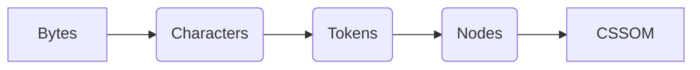
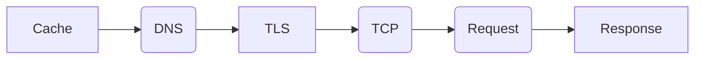

# 测试

需要测试四个部分:

1.       没有搜索结果的 UI 展示.
2.       服务器正常且搜索到结果的情况
3.       服务器出现问题的情况
4.       是否能够成功缓存

 

先看没有搜索结果的情况. 输入一个很明显 stack overflow 下搜索不到的软件, 可以看到

在搜索栏下面正确的显示了 Nothing Search. 

接下来给一个对应的关键字, 能收缩到结果的—Webpack. 根据预期是能够显示搜索结果和对应的预览效果.

通过图 9-3 看出, 搜索结果正常, 并且成功地预览了该图片. 虽然搜索 webpack 标题中没有出现该字样, 但是 Babel Loader 其实就是 Webpack 的一个主要插件, 另外在预览中也出现了 Webpack 的字样, 所以这个搜索结果也没有问题.

因为前端依赖于后端的预加载, 那么如果后端网络不佳怎么办? 在现实生活中基本上不会碰到这种现象, 但是作为本地项目, 服务器和浏览器都是在一起的, 还是需要考虑下. 预期的结果是能够通知这种现象, 并且所有的结果都仅仅显示 URL.

现将本机的 Wi-Fi 关了, 服务器的网络状态自然就不好了. 接着测试一个非 Webpack 的关键词, 看看结果. 右上角的黄色矩形框就是用来显示这种行为, 另外在实际中, 这个显示只会持续 2s, 然后自动消失. 图展示的是它刚刚出现的效果.

最后了解一下 Cache 的缓存效果. 还是继续保持 Wi-Fi 的关闭, 在搜索引擎中, 重新输入 GitHub, 还是能得到缓存的结果.

综上所述, YSE 的基本功能没有任何问题.

