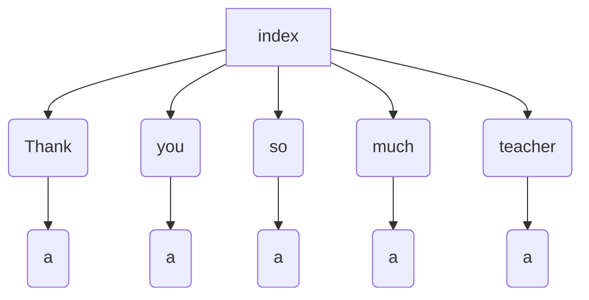
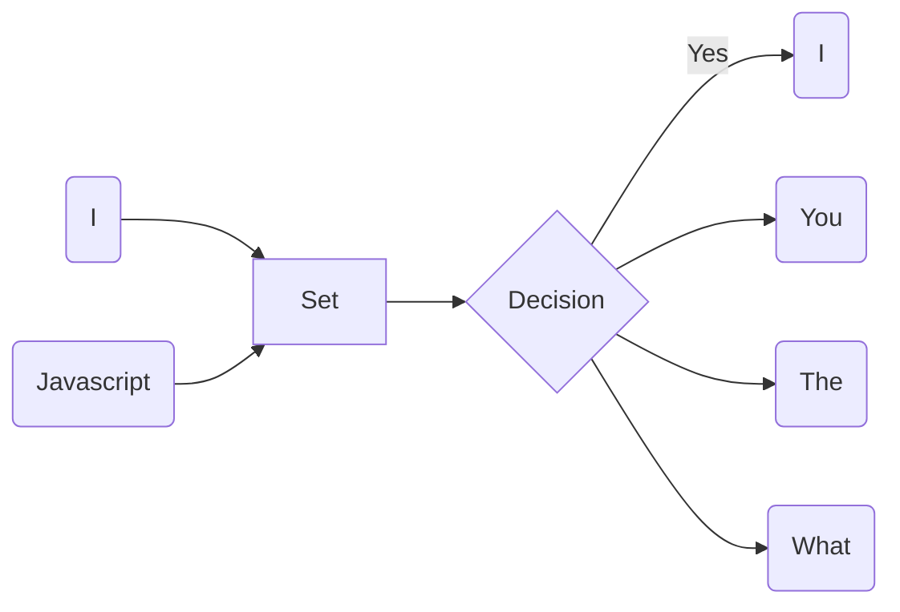

# 索引

搜索引擎不仅仅是希望能搜索到某个关键字, 还要获得相应的链接, 这样才有搜索的价值.

所以需要一个结构来记录一个关键字可能出现在的所有 URL 中. 举个例子

网页 a 含有 5 个 单词: 

1. Thank
2. you
3. so
4. much
5. teacher

那么就应该生成一个这样的索引



每一个单词都保存对当前网页的引用才行. 对应到 Js 中, 就应该是

```js
const index = {
  'Thank': 'a',
  'you': 'a',
  'so': 'a',
  'much': 'a',
  'teacher': 'a',
}
```

实际过程中, 一个单词肯定不可能仅仅出现在一个网页中, 所以每个词对应的不是一个字符串, 而是一个数组. 数组保存着这个单词出现过得所有网页链接才行.


## 基本实现

因为目标是英文, 使用空格就可以分词了.相比中文来说很容易处理. 不过因为空格分出来的可能还带有标点符号, 所以需要把它们去掉. 先定义几个常用的标点符号

```js
const punctuation = '!"#$%&\'()*+,-./:;<=>?@[\\]^_`{|}~';	
```

在 JS 中, 这种类型可以交给正则表达式. 比如一个句子, `your are, so good!`. 要想把它拆成 `['you', 'are', 'so', 'good']` 的话, 再将上面的标点符号改为正则的形式

```js
const reg = new RegExp(`[${punctuation}]`, 'gm')
```

接下来就能通过内置的 `replace` 函数将标点全部去掉

```js
const words = txt.replace(reg, '').split(' ')
```

成功分词后, 下一步就把每个链接和单词对应上来. 先以 `cherrio` 为例子, Stack Overflow 网站的正文都是在一个 `div.container` 下面, 也能判断它们的网页是由 React 编写的, 当然这是后话了.

运行 `$('div.container').text().replace(reg, '').split(' ')` 就能将整个网站的文本全部拆分开来. 接下来需要做的事情就是建立索引.

```js
const index = allPages.reduce((index, page) => {
  const words = cherrio(page)('div.container')
  	.text().replace(reg, '').split(' ');
  
  words.forEach(word => {
    if (index[word]) {
      index[word].push(url)
    }
    index[word] = [url]
  })
  
  return index
}, {})
```

在这段代码中, 假设 allPages 就是我们需要遍历的所有的网页数据, 通过遍历它来获得单个网页的文本内容. 接下来就像上面说到一样, 建立一个分词数组. 之后再判断索引中是否已经有该单词, 作出对应的逻辑. 其中`reduce` 和 `forEach` 可以看成对 for 循环的一种**抽象**

尝试运行一下后, 可以得到下面结果


为什么一个 URL 会被多次加进来呢? 原因也很明显, 整个网页的单词冗余度是很高的, 所以一个单词出现的次数可能不止一次. 解决这个问题的方法有几种, 

1. 将数组改成 Set
2. 每次插入之前检查数组的最后一个 URL 是否和这个 URL 相同

本文选择使用第二种方案, 因为每个 URL 只会被爬取一次, 换句话说, 这个数组即使冗余一定是 `[a,a,a,a,b,b,b,c,c]` 这种形式, 而不是是 `[a,a,a,b,b,a,b,a,c]` 这种形式. 而第一种方法, 看上去只需要 $O(1)$ 的时间复杂度, 但是 Set 的初始化过程并不那么简单. 需要伴随着一个比较大的空间一起分配出来, 在单词量很大的情况下, 性能也并不那么突出咯. 另外为了保存成 JSON,  Set 再转化成数组也是有开销的. 

所以将 `if(index[word])` 改为 `if(index[word] and index[word][-1] != url)` 来解决这个问题.

## 和爬虫整合

现在已经理清了基本的逻辑, 接下来整合进爬虫中. 回忆下之前的 strcpy 的代码, `parse` 函数是爬虫的关键逻辑所在, 所以只需要将建立索引的逻辑也放在这里. 并在爬虫结束后, 将索引保存成文件.

根据 scrapy 文档, `close` 函数会在爬虫终止后调用, 所以可以在这里实现保存索引的功能. 

```python
    def close(self):
        with open('./index.json', 'w') as f:
            f.write(json.dumps(self.index, indent=2))
```

这是在以 Stack Overflow 为种子网页爬取后的部分保存结果

```json
  "tsql": [
    "https://stackoverflow.com/?tab=month",
    "https://stackoverflow.com/users/2919045/hkravitz"
  ],
  "join": [
    "https://stackoverflow.com/help/badges/644/join?userid=650492",
    "https://stackoverflow.com/users/650492/johan?tab=badges",
    "https://meta.stackoverflow.com/questions/359465/should-serial-downvoter-be-punished-notify",
    "https://meta.stackoverflow.com/questions/251758/why-is-stack-overflow-so-negative-of-late",
    "https://stackoverflow.blog/2018/02/05/secret-behind-great-developer-onboarding/"
  ],
```

闲杂看到每个单词都对应着它出现过的网页的链接.

但是, 还有一件很重要的事情被遗忘了. 自然语言的冗余度很高, 某些单词每个网页出现的频率都会非常高, 但是它们对于搜索的意义不大. 比如 *The, I, Do, You, How, What* 这些, 所以应该做一些预处理把它们去掉, 本文收集了 200 个左右的**占位符**.

在这里就可以将这些占位符存储为一个 Set , 对每个单词都进行过滤, 得到最后的结果.




### 后端利用

有了索引后, 后端只要在启动的时候读取该文件, 转化成字典, 根据搜索词来映射.

```js
    if (index === null) {
      const txt = await readFile(filePath, {
        encoding: 'utf-8',
      });
      index = JSON.parse(txt);
    }

    const search = index[q];
    if (!Array.isArray(search)) {
      ctx.body = 'Nothing search';
      return;
    }

    ctx.body = search;
```

同样的, 后端“接口”改了, 前端也需要做一点处理. 现在收到的是 URL 数组, 仅仅将数组转化成字符串来展示的话可不行, HTML 会自动去除换行和空格, 显示出来的效果只会是一长串 URL. 可以将它们调整为 ol 的形式来展示这段 UI.

```js
<div className="content">
  {Array.isArray(response) ? (
    <ol>
      {response.map(result => (
        <article className="message is-link" key={result}>
          <header className="message-header">
            <a href={result}>{result}</a>
          </header>
          <div className="message-body">You got me!!!</div>
        </article>
      ))}
    </ol>
  ) : (
    <p>Nothing Search.</p>
  )}
</div>
```

关键改动是这一块, 在尝试输入 react 的时候.


可以发现索引中有四个链接, 并且对应的 URL 链接都已经显示出来. 而 *you got me* 这个占位符可以在后续通过服务器预处理, 将网页的内容一并返回回来.

这样, 索引的建立就告一段落了. 下面介绍一下 Rank 算法.