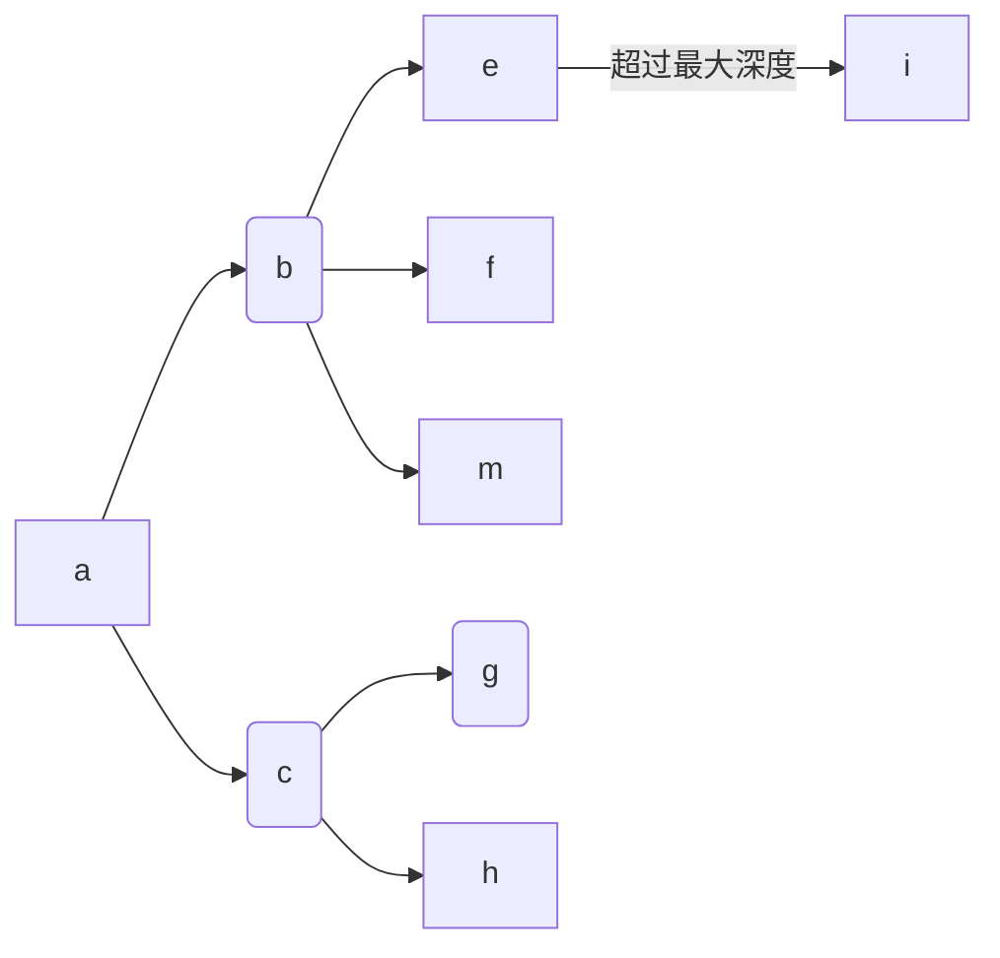

# 面向小规模量的全文搜索引擎的设计和实现

# 摘要

时代飞速发展, 技术日新月异, 对开发者的要求也越来越高. 当年的“切图仔”演变成现在的**全栈工程师, 大前端**就是前端工程师的发展写照.
曾经认为女生才应该去写前端的, 前端就是写写界面的人, 在目前看来可以说是错的离谱.
最基本的前端工程师需要了解的知识体系甚至比后端还复杂. 每一个前端工程师都需要会写服务器代码, 每一个前端工程师都需要会写原生应用.

好在 JavaScript 确实赋予了他们这种能力. Nodejs 是让前端开发者抬起头, 后端开发者学习前端的一个跨时代的平台. React Native 的出现让 JavaScript 也能写 iOS 和 Android 应用. Electron 更是让 JavaScript 可以攻占桌面级的应用. 本论文编写的所有代码都是由一个基于 JavaScript 搭建的编辑器完成.

可以说, JavaScript 的生态已经势不可挡了. 所以本论文也通过搭上这本快车, 使用 Js 来投建一个简易的搜索引擎, 来探索**全栈的可能性**. 其中前端采用的是 React, 后端基于 Nodejs 搭建.

该搜索引擎会爬取 Stack Overflow 的一些内容, 尝试在输入关键字后, 能够将本站的相关网页显示出来. 排名的方式主要基于其他网页索引该网站的次数.

关键字: React; Koa; Nodejs; Search Engine; Python;


# Abstract

With the rapid development of the era, technology is changing with each passing day, and the requirements for developers are also getting higher and higher. The “front-end engineers” of the entire “stack” engineer nowadays are the development portrayal of front-end engineers.
Those who think that girls should write front-ends, front-end writers and writers seem to be wrong at the moment.
The basic knowledge that front-end engineers need to understand is even more complex than the back end. Every front-end engineer needs to write server code. Every front-end engineer needs to write native applications.

Fortunately, JavaScript really gives them this ability. Nodejs is a cross-generational platform for front-end developers to look up and front-end developers learn about the front-end. The emergence of React Native makes it possible for JavaScript to write iOS and Android applications. Electron is Let JavaScript take over desktop-level applications. All the code written in this paper is done by a JavaScript-based editor.

It can be said that the ecology of JavaScript has become overwhelming. Therefore, this paper also hopes to use JS to build a simple search engine to explore the possibility of a full stack. The front end uses React, backend built by Nodejs.

The search engine crawls some of Stack Overflow's content and tries to display the site's related webpage after entering the keyword. The ranking method is mainly based on the number of times other websites index the website.

Keyword: React; Koa; Nodejs; Search Engine; Python;

# 绪论

## 发展意义和背景

随着时代的不断演进, 人们对于互联网的依赖程度, 以及对**用户体验**要求提升, 开发人员面临的挑战也越来越多. 知识和技术已经学不过来, 更新速度非常之快. 一位作者可能刚将一本技术书写完, 该技术就更新了新版本, 带来了**破坏性改变**, 一夜之间这本书似乎就过时了. 为了更快速的学习知识, 搜索引擎对于开发人员来说是不可或缺的. 面向 Google 编程, 面向 Stack Overflow 编程是一种趋势. 如果没有 Google, 开发人员很难找到解决方案. Stack Overflow 里如果不能搜索, 这个网站也没有存在的意义.
所以, 尝试自己去搭建一个搜索引擎, 是十分必要的. 再也不用惊叹于搜索的神奇, 拉近和后端工程师们的距离.

## 发展趋势

国内: 国内的搜索引擎以百度最为闻名. 但是因为过于商业化, 以及对技术人员的不友好, 基本上就和 Siri 一样, 总是答非所问. 在国内一般是作为不能科学上网的备用选择. 而其他的搜索引擎, 比如某数字公司和某动物公司的有一定的市场份额, 但基本没有尝试的必要

国外: 国外的著名的搜索引擎有: **Google, Bing, Yahoo, DuckDuckGo**. Google 和 DuckDuckGo 的英文搜索体验相当, 都能给出想要的效果, 都支持自动翻译和错别字矫正功能.
但是近年来, 随着 Google 向人工智能的发力, 我们用 Google 搜索的任何内容都会被分析, 并生成一个用户的特征模型, 以能够推送更加准确的信息流. 也就是说现在 Google 不仅仅是一个搜索引擎, 而是一套信息服务. 

本论文显然不会以模仿 Google 甚至超越 Google 的某一方面位目标, 它最大的功劳是协助这篇论文的面世.

## 系统开发目标

前端采用 React 构建, React 和传统 MVC 模式的框架不同, 采用的是一种声明式的编程方式. 将**函数式编程的思想渗透其中**. 后端采用的 Koa 是一个比较新的 Nodejs 框架. 它充分拥抱了 `async await` 模式, 让开发者从 Nodejs 的 `callback hell` 中解脱出来, 使用更为现代的方式编程.
搜索引擎的目标是在确定搜索后, 顺序的响应的用户的搜索内容, 并给出一个拥有合理排序的搜索内容.

# 基本背景知识

## HTTP 协议

为了更好的理解搜索引擎的本质和原理, 先来一起探索下它所依赖的协议: **HTTP.**
HTTP 最新版本是 2, 相比 1.1 带来革命性的提升和改变. 不过为了方便理解, 本文还是基于 HTTP 1.1 来解释整个流程. 另外, HTTP 协议以下的协议栈, 只解释到 TCP 层.

拿 Google 举例, 在搜索框中输入搜索内容后, 按下回车或者 **Search** 按钮, 开始的第一步就是将输入的内容传入一个叫做 **q** 的参数, 以及其他细节参数一起组装好. 加上 HTTP 请求行, HTTP 首部. 包装成一个 **GET** 请求. 为了简单, 这里还是忽略了很多细节, 比如 Google 的搜索建议.

这个请求可能长这样:

```http
GET / HTTP/1.1
HOST: www.google.com.hk
Accept: */*
```

包装好后, 还需要一个伙计将该请求传送到 Google 的 IP 下. 关于获取 IP 的方法不是本文的重点, 只要知道是通过 **DNS** 协议来实现的. 一旦获取到 IP, 这个伙计就能工作了. 欢迎 **TCP**

TCP 协议最广为人知的地方就是它的三次握手, 简单回顾下.

1.  浏览器发出一段 datagram 给 Google , 里面包含了 SYN 字段
2.  Google 收到该 datagram 后, 作出处理(比如分配内存), 也发出一段 datagram, 包含了 SYN 和 ACK 字段
3.  浏览器收到 datagram, 将之前的生成的 HTTP 请求和 ACK 字段一起发送给 Google


```sequence
Browser -> Google: SYN
Note right of Google: Google Server alloc socket and resource, and response
Google -> Browser: SYN ACK
Browser -> Google: ACK Body
```


经过这些步骤, Google 服务器终于知道要搜索什么内容, 并做了一番处理, 将结果返回给了浏览器. 这里的一番处理可不简单, 也是本文的努力目标.

浏览器获取到了 Google 的响应, 比如这样

```http
HTTP/1.1 200 OK
content-type: text/html
content-length: …

…………
```

Google 返回的仅仅是一个 HTML 文件. 随着浏览器去解析该 HTML 文件, 接着就会将 HTML 中的其他**关键路径上的文件**获取. 比如 CSS, JS 或者其他 SVG 图片. 最后就能看到结果.

## TLS

上面其实遗漏了一些内容. Google 现在是基于 HTTPS 的, 也就是说, 在发送 HTTP 请求之前, 还需要和 TLS 协议进行一段沟通. 相比 TCP, 过程更为复杂.

1.  浏览器发送一段 _Client Hello_ 信息给 Google, 并且带上了一个随机数和支持的加密方法(协商)
2.  Google 回应了一段 _Server Hello_ 信息给浏览器, 带上了一个随机数
3.  同时 Google 把它的证书发送给浏览器(在某些金融网点, 还需要浏览器提供证书). 这是一个 _Server Done_ 信息
4.  浏览器确认 Google 的证书有效, 就会生成第三个随机数, **Premaster secret**. 用 Google 的公钥加密这个随机数并发送给 Google. 如果发现证书无效或者过期了, 浏览器就会发出警告, 阻止用户访问
5.  Google 使用自己的私钥解密了这个浏览器. 这个时候, Google 和浏览器都会使用这三个随机数生成的一个会话秘钥 **session key** 来加密接下来的信息
6.  浏览器会发送一个 _Change cipher spec_ 来通知 Google, 接下来所有的信息都要开始加密. 同时发送 _Client Finished_ 信息
7.  Google 收到了该通知, 开始使用会话秘钥. 并发送 _Server Finished_ 信息
8.  现在浏览器和 Google 已经建立好加密通道, 所有的消息都会被加密. 接下来的步骤就回到了上面的 TCP 过程

这个过程确实很复杂, 至于公钥和私钥的生成细节这里就忽略, 以便带来更多的复杂性.
虽然本文跳过了一些步骤, 但是主要的过程已经描述清楚. 可以看一张图来巩固一下


回到 Google 返回 HTML 的地方, 浏览器到底是如何使用 HTML, CSS, JavaScript 在屏幕上渲染漂亮的网页呢?

## 关键渲染路径

一个 HTML 文件从加载到显示出来的过程, 被称为 **关键渲染路径**. 一般分为 4 个步骤

1.  DOM 树构建
2.  CSSOM 构建
3.  布局(Layout)
4.  绘制(Paint)
    本文暂且不讨论 JavaScript 的逻辑. 因为现代 JavaScript 过于复杂, 这方面有很优秀的[素材](https://developers.google.cn/web/fundamentals/performance/critical-rendering-path/adding-interactivity-with-javascript)

### DOM 树的构建

为了简化复杂性, 先假设 HTML 里仅仅包含一些简单的文本和一张图片, 则 DOM 树的构建过程为

1.  **转换:** 浏览器先读区磁盘(缓存)或者网络中 HTML 的原始字节, 使用文件指定的编码方式(UTF-8), 将它们转化成字符
2.  **Token 化:** 将字符中所有 W3C 标准中规定的标签[^1]换成特定的 Token
3.  **词法构建:** 将所有 Token 转化成规则对象
4.  **DOM 构建:** 根据标签和标签之间的包含关系来建立 DOM 树


整个流程还可以用一张图来表示


### CSSOM 构建

在构建 DOM 树的构成中, 会碰到 `link` 标签. 如果标签中引用了 css 文件的话, 浏览器**优先去**构建 CSSOM, 和过程和构建 DOM 树相似.

### 渲染树

在 DOM 和 CSSOM 都构建好后, 浏览器就会将 DOM 和 CSSOM 合并, 生成新的 **Render Tree**
为了构建它, 浏览器做了这些步骤:

1.  从 DOM 树根节点开始遍历不可见的节点: `meta, script`, 不会出现在渲染树中通过 CSS 隐藏的节点: `display: none`, 也不会出现在渲染树中
2.  对所有可见的节点, 应用 CSSOM 的规则
3.  生成渲染树


接着根据渲染树中的样式信息, 浏览器进入 **Layout** 阶段. 这个阶段是为了弄清每个对象的确切位置和大小. 最后根据位置和大小, 浏览器就能将它们写入实际的像素中, 这里被称为 **Paint**

经历“穷山恶水”, 浏览器终于成功渲染了这些文字和图片.


# 编写爬虫

了解了基本的浏览器的运行机制, 现在可以进入到正题. 搜索引擎的构建, 在本文中, 主要分为三步:

1.  构建爬虫
2.  使用爬取的数据构建索引
3.  寻找一个合理的 Rank 算法

为了方便后文引用, 本文构建的搜索引擎用 YSE 来取代.
作为一个小型项目, YSE 不可能也不应该尝试去像其他搜索引擎一样, 爬取所有互联网上的页面, 应该将爬虫放在某个特定的网站下面, YSE 使用的是 [Stack Overflow](https://stackoverflow.com) 作为**种子** , 也就是爬虫开始的第一个界面.

## 获取一个网页上的超链接

为了测试爬虫的可行性, 先将任务简化, 从只获取一个网页的所有 **href** 开始, 不做任何文本处理. 在这里 href, 或者说 _Hyper Reference_, 指的是 a 标签的 href 属性. 比如, **img, css, JavaScript** 这些文件都不是爬虫感兴趣的内容. 根据 [CSS Selector](https://www.w3schools.com/cssref/css_selectors.asp) 规范, 使用一个很简单的 CSS 选择器就能实现 `a[href]`.

爬虫是基于服务器建立的, CSS 选择器属于 W3C 标准, 这个似乎应该只能在浏览器中存在, 怎么运用在后端呢? 这里需要澄清下, **标准是标准, 实现是实现. 实现可以参考标准, 并在任何平台实现**. 所以说, 浏览器上的 CSS 选择器是浏览器的实现, 后端当然也有后端的实现, 比如本文将要采用到的 [cheerio](http://cheerio.js.org), 就是 Nodejs 的一种**实现**

通过包管理工具下载好 cheerio 后, 输入
`import cheerio from 'cheerio'`
就能开箱使用了. 而想要获取一个网页的所有 href 内容的话, 可以写成

```js
const text = '………'; // text 变量是一长串文本
const $ = cheerio(text);

const allLinks = $('a[href]').map((_, element) => $(element).attr('href'))).get()
```

通过这种方式, 就能获得 text 所代表的 HTML 中所有的 href. 但在真正中的爬虫中, 传入的参数应该是 URL, 而不是整个 HTML 文件. 毕竟一个爬虫, 应该只需要关注种子网页就行了.

```js
const url = 'https://www.google.com';
const getPage = async url => {
  try {
    const html = await fetch(url).then(res => res.text());
    return cheerio.load(html);
  } catch (err) {
    console.log(err);
  }
};
const $ = getPage(url);
```

Fetch URL 的操作, 就由第四行, 也就是含有 `fetch` 的那一行完成了这个任务.
这样的话, 获取所有链接的任务就和之前的代码一样, 因为此时的 `$` 已经获得了 URL 的 HTML.

这段代码看上去没有任何问题, 不过, 还有一个隐藏的问题需要指出来.
`fetch` 只能支持**绝对路径**的 URL!
这很容易理解, 给一个 \_.\_abc.html/ 这种链接, 这应该被认为是读取本机文件的操作, 与其用 fetch 不如使用 `readFile`.
但是什么时候会碰到相对路径的情况呢?? 乍一看很难理解, 因为我们可以控制种子网页的内容, **不可能会传一个相对路径的 URL 进去**. 可是不能保证 a 标签中的 href 不是相对路径!
这个问题有两种方法来解决, 第一种是过滤所有的相对路径, 第二种则是将相对路径转化成绝对路径. 第一种实现简单, 只需要改一下选择器, 改为 `a[href^=http]` 就解决问题了. 这个选择器的意思就是**筛选所有 href 属性由 http 开头的 a 标签**, 这样就能保证得到的路径都是绝对路径.
从开发人员的角度, 相对路径比绝对路径好写多了. 所有一个网站中, 更多的可能使用的还是相对路径, 这种自损三千的方法, 接下来会改进.

## 放出爬虫

现在已经知道如何获得一个网页中所有的 href, 可以使用下面的代码来看看效果

```js
console.log(allLinks(getPage('https://stackoverflow.com')));
```

不出意外的话, 会输出类似于这样的结果.


接下来可以将爬取到的所有网页内容, 加入数组, 递归执行爬取步骤.
既然是递归, 就需要有一个递归的终止条件. 这里的终止条件就是数组为空为止.

不过会引发一个问题, 数组一定会为空吗? 答案是很可能不会
原因有几点:

1.  存在外链
2.  链接之间会相互引用
3.  链接太多

最后一个很容易理解, 如果链接太多的话, 那么想要在相对短的时间内爬取所有网页显然是不可能的. 一个可行的方法是规定爬取次数否则爬取时间. 比如爬取 10000 个或者运行十分钟后停止.
前面的两个原因, 也能很好的解决. 第一个问题我们只要对爬取到的链接进行一次筛选, 将主机不是 Stack Overflow 的域名去掉. 而第二个循环链接的问题, 可以通过保存所有访问过的链接, 并且只访问没有访问过得链接来解决.
其实循环链接的问题和广度优先搜索的解决方法很相似. 没错, 爬虫使用的就是广度优先的策略. 为什么不用深度优先呢? 因为这很容易导致栈溢出…

通过上面的分析, 爬虫终于可以派上用场了.

```js
const crawlWeb = async seed => {
  let tocrawl = [seed];
  const crawled = {};

  while (tocrawl.length) {
    const page = tocrawl.pop();
    if (!crawled[page]) {
      const $ = await getPage(page);
      const outlinks = getAllLinks($);
      tocrawl = union(tocrawl, outlinks).filter(link => {
        return new URL(link).hostname.includes('stackoverflow');
      });
      crawled[page] = true;
    }
  }
};
```

接下来要解决之前遗留的问题: **处理相对路径**. Nodejs 的 URL 方法只能转换绝对路径, 否则就会抛出异常.
比如 `new URL('./abc')` 这样就会报错. 于是可以利用它的报错, 配合 `try catch` 来将相对路径转化成绝对路径. 回到之前 `getAllLinks`

```js
const getAllLinks = ($, page) => {
  const { origin } = new URL(page);
  return $('a[href]')
    .map((_, element) => {
      const href = $(element).attr('href');
      try {
        new URL(href);
      } catch (err) {
        return href[0] === '/' ? `${origin}${href}` : `${origin}/${href}`
      }
      return href;
    })
    .get();
};
```

`getAllLinks` 和之前相比多了一参数—page, 它用来保存正在爬取的网页的信息. 可以通过它了解到当前网站的 hostname 和 origin, 再添加到相对路径之前就可以得到绝对路径.

### 限制搜索深度和长度

因为现实的复杂性, 还是不能盲目的假设爬虫最终会停下来, 所以还是要限制下爬虫的搜索深度和长度搜索的长度很容易限制, 回忆这个代码 `while (tocrawl.length)`

除了每次检查数组的是否为空外, 也要检查当前数组的长度, 如果超过了一个限制值, 也会的结束爬取. 改成 `while (tocrawl.length && len(tocrawl) < maxLength)` . 同样的搜索深度也可以做到限制. 




解释下这张图, a 网页里包含了两个 b 和 c 网页. 当爬取完  a 后, 深度加一. 继续开始爬取 b 和 c 的网页, b 又有 e 和 f, m, c 网页又有链接 g 和 h. 当 g 和 h 爬取完后, 深度继续加一. 就这样通过跟踪深度, 就能在合适的时机退出来. 

### robot.txt

但是爬虫并不是肆无忌惮的. 一般网站都会有一个 [robot.txt](https://en.wikipedia.org/wiki/Robots_exclusion_standard) 文件, 来告诉爬虫: 哪些路径是运行爬取的, 而哪些路径是不运行爬取的.
爬虫必须遵守它的规则, 否则本地的 IP 很容易被网站加入黑名单, 再也不能访问该网站. 所以我们的爬取策略也要做出修改, 在开始爬取之前先读取站点的 robot 文件.
这个文件的位置很有讲究, 一般都位于网站的根目录下. 比如 Stack Overflow 的 robot 地址应该是 `stackoverflow.com/robot.txt`.

它的 robots 部分样子


针对这种简单形式的 robot, 可以实现一个自己的解析函数

```js
const fetchRobot = async url => {
  const robotUrl = `${url}/robots.txt`;
  const disallow = [];
  if (robotUrl) {
    const robot = await fetch(robotUrl).then(res => res.text());
    robot
      .split('\n')
      .filter(str => str.startsWith('Disallow'))
      .forEach(ban => disallow.push(ban.slice(ban.indexOf('/'))));
  }
  return disallow;
};
```

因为结构的单一, 只需要取出所有以 `Disallow` 开头的行的链接, 得到一个数组. 因为这个数组也不长, 在检测时候是合法链接的时候, 可以尝试一种十分低效但是简单的方式: 对于爬取的每个链接都在这个数组中检查一下.

## Scrapy

可是为了实现一个搜索引擎, 上面的这种方法就不行了, **它不够快**. 浪费太多笔墨来强调如果写出一个高性能的 Nodejs 爬虫是不划算的. 介绍 Scrapy 一个强大的 Python 爬虫框架来完成 YSE 接下来的爬取任务.

官方对它的介绍是:

> An open source and collaborative framework for extracting the data you need from websites.
>
> In a fast, simple, yet extensible way.


注意第二句, **yet extensible  way** 满足了性能上的需求. 而上面提到的爬虫需要注意的问题, 它已经全部抽象了. 使用者只需要专注于如何编写爬虫的逻辑, 不需要考虑其他的细节.


根据官方文档, 可以很容易写出几个爬虫, 用来爬取特定的内容. 以 Stack Overflow 官网为例, 如果想知道今天的问题有哪些, 可以自己上浏览器输入, https://stackoverflow.com/?tab=featured. 也可以手动写一个爬虫, 来爬取关注的信息. 这里以获得每个问题的

+ 投票数
+ 回答数
+ 浏览量
+ 标题

为例, 可以写出下面代码

```python
import scrapy

class StackSpider(scrapy.Spider):
    name = 'stackoverflow'
    start_urls = [
        'https://stackoverflow.com/?tab=featured',
    ]

    def parse(self, response):
        for question in response.css('.question-summary'):
            yield {
                'votes':
                question.css(
                    'div.votes .mini-counts span::text').extract_first(),
                'views':
                question.css(
                    'div.views .mini-counts span::text').extract_first(),
                'answers':
                question.css(
                    'div.answered .mini-counts span::text').extract_first(),
                'title':
                question.css('.summary > h3 > a.question-hyperlink::text')
                .extract_first(),
            }

```

代码中的 CSS 不仅仅遵循了 w3c 标准, 而且还做到了扩展. 在 cherrio 中, 找到某个特定选择器的元素里的文本内容, 需要  `$('.votes .mini-couts span').text()`, 而 scrapy 通过一种类似于**伪元素的拓展**做到了可以获得 text 的内容.

接着在命令行中运行

```bash
scrapy crawl stackoverflow -o stackoverflow.json
```

这样可以将所有爬取到的内容整理成一个 JSON 文件. 有了 JSON 文件, 相比每次搜索都立刻去爬取数据, 速度就能快很多.


## 前后端

有了数据, 就开始利用它们. 可以开始快速搭建开发所需要的代码了. 

### 后端

基于 Nodejs 的应用都离不开包管理工具, 但是它又不同于 Python 中的 `pip`. `pip` 在安装了某个包后, 就可以在任意代码中 `import` 导入它. 而 Nodejs 的 npm 或者 yarn, 只能每一个开发环境都装一次, 第一次看到会觉得非常麻烦. 这显然和 JavaScript 这个语言的背景有关, 因为它最早的定位就是在浏览器中运行, 而且是一本脚本语言. 在浏览器中运行说明它的权限肯定会被限制, 只能读取相对路径的文件. 同时, 又因为它是脚本语言, 只会在运行的时候开始读取所需要的资源. 

不过, Nodejs 作为一个运行时环境, 也有自己的一些内置组件. 这些组件已经被预装在 Nodejs 中, 可以在任何项目中直接读取. 

开始安装所需要的包:

```bash
mkdir myproject && cd $_ && yarn add koa koa-router axios classnames
```

因为已经将爬虫的工作交给 scrapy, 暂时就不用安装 cherrio 了. 

现在只是只是为了看看成果, 服务端代码还不会多么复杂, 添加一个路由就行了.

```js
import Koa from 'koa';
import router from './route';
const app = new Koa();

app.use(router.routes());

app.listen(3001);

```

加起来也就 5 行代码, 运行后就能监听 3001 端口. 第二行的 route.js 里面服务端和路由有关的代码. 只需要搜索的功能, 所以只定义一个 `/search` 路由就已经够了. 这段代码也很简单

```js
import fs from 'fs';
import path from 'path';
import { promisify } from 'util';
import Router from 'koa-router';
import { URL } from 'url';

const readFile = promisify(fs.readFile);

const router = new Router();
const filePath = path.resolve(__dirname, '../db/stackoverflow.json');
let index = null;

router.get('/search', async ctx => {
  const params = new URL('http://localhost' + ctx.url);
  const q = params.searchParams.get('q');

  try {
    if (index === null) {
      const txt = await readFile(filePath, {
        encoding: 'utf-8',
      });
      index = JSON.parse(txt);
    }

    const search = index.filter(question => question.title.includes(q));
    if (!search.length) {
      ctx.body = 'Nothing search';
      return;
    }

    ctx.body = JSON.stringify(search);
  } catch (err) {
    console.log('file not found');
    ctx.body = 'Bad!';
    ctx.status = 404;
  }
});

export default router;

```

关键逻辑就在 `const search = index.filter(question => question.title.includes(q))` 这一行. 目前用了一种很幼稚很慢的检索方法, 在 Stack Overflow 的 feature 中逐字逐句的匹配 title. 


### 前端

现在只需要展示搜索的结果, 所以不需要注意力过分放在 UI 上. React 代码一般会分离两种概念, 一种专门用来渲染 UI 不关心任何业务逻辑的组件—Component, 另外一种则是仅仅关注业务逻辑但不关心 UI 的组件—Container.


就比如, 一个 List 组件, 可以写成下面这样子

```jsx
const List = ({data, onClick}) => (
	<ul>
		{data.map(({title, value}) => (
			<li key={title} onClick={onClick}>{value}</li>
		))}
	</ul>
)
```

这个组件只需要两个 props, 一个 data 用来控制需要展示的数据, 一个 onClick 是用来响应列表被点击的事件. 而它没有关注如果自己编写逻辑, 所有数据都是由其他的组件来传入. 这就是 Component 的本质.

同样的, 对应的 Container 的代码可以是

```jsx
class View extends React.Component {
  data = [{title: 'good', value: 'oo'}, {title: 'bad', value: 'xx'}]
  
  onClick = () => alert('You click me!')
  
  render() {
    return <List data={this.data} onClick={this.onClick} />
  }
}
```

虽然这个编造的例子看上去很生硬, 但是已经很好的完成了它的任务—实现业务逻辑


回到前端的代码上来, 目前的实现只需要有一个搜索框, 能在输入完成后, 向后端发送一个请求, 处理分析后端返回的数据并展示出来. 

大概流程是这样

```sequence
浏览器 -> 服务器: 看到我要搜索的东西了吗?
Note right of 服务器: 从磁盘中读取爬虫数据, 开始匹配
服务器 -> 浏览器: 这是你的搜索结果, 拿去
```


下面是点击搜索后的逻辑代码:

```js

  onSearch = async event => {
    event.preventDefault();
    this.setState({ isSearching: true });
    try {
      const { data } = await axios.get('/search', {
        params: {
          q: this.state.searchValue,
        },
      });

      const response = Array.isArray(data)
        ? data.map(question => question.title).join('\n')
        : data;
      this.setState({
        response,
      });
    } finally {
      this.setState({ isSearching: false });
    }
  };
```

这里的 `axios` 和前文的 `fetch` 方法的效果类似, 不过 axios 的封装更为良好, 所以后文都会采用它.

展示 UI 的代码就不展示了, 目前的效果如图所示.


如果输入一些搜索内容, 比如 `curl` 的话, 就能出现搜索的结果.


可以看到已经能搜索出正确的结果了.

[^1]: http://www.w3.org/TR/html5/